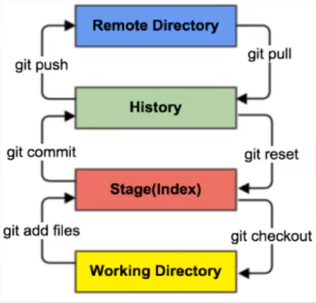

### linux基本命令

1. cd  改变目录
2. cd ..  回退到上一个目录,直接cd进入默认目录
3. pwd  显示当前所在目录路径
4. ls(ll)  都是列出当前目录中的所有文件,只不过ll列出的内容更为详细
5. touch  新建一个文件,如  touch index.js  会在当前目录下新建一个index.js文件
6. rm  删除一个文件,rm  index.js  就会把index.js文件删除
7. mkdir  新建一个目录,即新建一个文件夹
8. rm -r  删除一个文件夹,rm -r src  删除src目录
   1. `rm -rf /  切勿在linux中尝试,删除电脑中全部文件`
9. mv  移动文件,mv index.html src  移动index.html文件到src目录下
10. reset  重新初始化终端/清屏
11. clear  清屏
12. history  查看命令历史
13. help  帮助
14. exit  退出
15. \#  表示注释

### Git配置

查看配置`git config -l`

查看不同级别的配置文件:

````bash
#查看系统config
git config --system --list

#查看当前用户(global)配置
git config --global --list
````

**git相关配置文件:**

1. git\etc\gitconfig	git安装目录下的gitconfig	--system 系统级

2. C:\Users\Administrator|\.gitconfig	只适用于当前登录用户的配置	--global 全局

   这里可以直接编辑配置文件,通过命令设置后会影响到这里

> **设置用户名与邮箱(用户标识,必要)**

当你安装完Git后首先要做的事就是设置你的用户名和email地址.这是非常重要的,因为每次git提交都会使用该信息.它会被永远的嵌入到你的commit中

```bash
git config --global user.name "Volerde"	#名称
git config --global user.email Volerde@outlook.com	#email
```

只需要做一次这个设置,如果你传递了--global选项,因为git将总是会使用该信息处理你在系统中所做的的一切操作.如果你希望在一个特定的项目中使用不同的名称或email地址,你可以在该项目中运行该命令而不要--global选项.

### Git基本理论

> 工作区域

Git本地有三个工作区域：工作目录(Working Directory)、暂存区(Repository或Git Directory).如果再加上远程的Git仓库(Remote Directory)就可以分为四个工作区域.文件在这四个区域之间的转换关系如下:



+ Workspace：工作区，平时存放项目代码的地方
+ index/Stage：暂存区，用于临时存放你的改动，事实上他只是一个文件，保存即将提交到文件列表信

### 当你创建一个新的仓库

1. 使用`git init`来初始化一个本地仓库

   ```bash
   git init
   ```
   
2. 查看本机是否存在ssh

   ```bash
   cd ~/.ssh
   ```

3. 创建ssh

   ```bash
   ssh-keygen
   ```

4. 查看ssh

   ```bash
   cat ~/.ssh/id_rsa.pub
   ```

5. 将ssh添加到远程仓库

6. 添加远程仓库

   ```bash
   git remote add origin git@github.com:Volerde/xxx.git(你的仓库地址)
   ```

7. 拉取远程分支信息,首次拉取合并信息

   ```bash
   git pull
   ```

8. 提交到远程仓库

   ```bash
   git push -u origin master
   ```


### git others

1. 查看本地提交记录

   ```bash
   git log
   ```

2. 查看最新一次{id}的提交详情

   ```bash
   git show {id}
   ```

### git本地分支和远程分支改名

1. 将本地分支进行改名

   ```bash
   git branch -m old_branch new_branch
   ```
   
2.  将远程分支的老分支删除

   ```bash
   git push origin :old_branch
   ```

3.  将改名后的分支push到远程

   ```bash
   git push origin new_branch
   ```

   

### issues

**Git在push推送时，报错提示信息如下：**

```bash
hint: Updates were rejected because the tip of your current branch is behind
hint: its remote counterpart. Integrate the remote changes (e.g.
hint: 'git pull ...') before pushing again.
```

**原因分析：**
是由于本地和远程仓库两者代码文件不同步，因此需要先pull，进行合并然后再进行push

**解决方法：**

1. 先使用pull命令：

   ```bash
   git pull --rebase origin master
   ```

2. 再使用push命令：

   ```bash
   git push -u origin master
   ```

