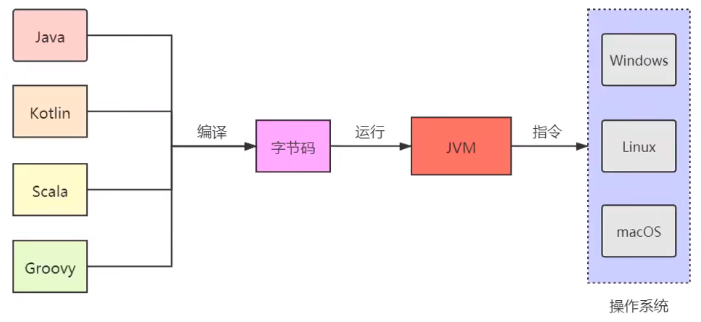
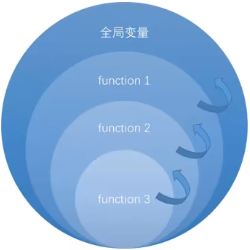
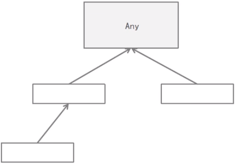
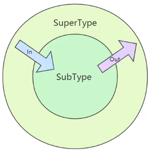
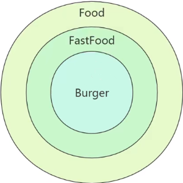

# Kotlin

### 简史

**诞生之初**

2011年，由JetBrains开发，运行于JVM，2017年官宣成为Android开发语言。kotlin语法简洁，具备现代高级语言特性，能与java无缝互操作。

**Kotlin与JVM**

编译型语言，更多的依赖于编译器



**Why Kotlin？**

+ Java语言比较稳健，久经考验。多年来，他一直是最常用的一种编程语言，因此造就了庞大的生产代码库。自1995年java问世以来，对于优秀的编程语言应该满足什么样的条件，人们已通过实践积攒了很多的经验教训。然而，java却裹足不前，开发者喜欢的很多现代语言的高级特性，他都没有，或者迟迟加入
+ Kotlin从这些经验教训中受益良多，而Java中的某些早期设计却愈显陈旧。脱胎于旧语言，Kotlin解决了他们的很多痛点，成为了一门优秀的语言。相比Java，Kotlin进步巨大，带来了更可靠的开发体验。

 **Kotlin的跨平台特性**

+ Kotlin不仅支持编写代码在虚拟机上运行，而且还是一门跨平台的通用型语言，我们可以用Kotlin开发各种类型的原生应用，如Android、macOS、Windows、JavaScript应用。
+ Kotlin能脱离虚拟机层，直接编译成可以在Windows、Linux、macOS平台上运行的原生二进制代码

### 初识

##### 变量

$\huge \underbrace {var}_{变量定义关键字}\underbrace{maximumAge}_{变量名}\underbrace{:Int}_{类型定义} \overbrace=^{赋值运算符} \underbrace5_{赋值}$


**Kotlin内置数据类型**

| 类型    | 描述             | 示例                                    |
| ------- | ---------------- | --------------------------------------- |
| String  | 字符串           | "Hello World"                           |
| Char    | 单字符           | 'A'                                     |
| Boolean | true/false       | true false                              |
| Int     | 整数             | 5                                       |
| Double  | 小数             | 3.14                                    |
| List    | 元素集合         | 1，8,10    \|    "Jack","Rose","Jack"   |
| Set     | 无重复元素的集合 | "Jack","Jason","Jacky"                  |
| Map     | 键值对集合       | "small" to 5,"medium" to 8,"large" to 9 |

**只读变量**

+ 声明可修改变量，使用var关键字
+ 声明只读变量，使用val关键字

**类型推断**

+ 类型推断：对于已声明并赋值的变量，Kotlin允许省略类型定义

**编译时常量**

+ 只读变量并非绝对只读
+ 编译时常量只能在函数外定义，因为编译时常量必须在编译时赋值，而函数都是在运行时才掉用，函数内的变量也是在运行时赋值，编译时常量要在这些变量赋值钱就已存在。
+ 编译时常量只能是常见的基本数据类型：String、Int、Double、Float、Long、Short、Byte、Char、Boolean。

**Kotlin的引用类型与基本数据类型**

+ Java有两种数据类型：引用类型与基本数据类型
+ Kotlin只提供引用类型这一种数据类型，处于更高性能的需要，Kotlin编译器会在Java字节码中改用基本数据类型

##### 条件语句

**表达式**

+ if/else if表达式

+ range表达式

  + in A..B，in关键字用来检查某个值是否在指定范围之内

    ```kotlin
    val result = if(i in 1..3) {
        //code
    } else if(i in 4..12) {
        //code
    } else {
        //code
    }
    ```

    

+ when表达式

  + 允许编写条件式，在某个条件满足时，执行对应的代码

  + 只要代码包含else if分支，都建议改用when表达式

    ```kotlin
    val school = "小学"
    val result = when(school) {
        "小学" -> "小"
        "中学" -> "中"
        "大学" -> "大"
        else -> {
            "未知"
        }
    }
    ```

    

**String模板**

+ 模板支持在字符串的引号内放入变量值

  ```kotlin
  val origin = "Jack"
  val dest = "Rose"
  println("$origin love $dest")
  ```

  

+ 支持字符串里计算表达式的值并插入结果，添加在${}中的任何表达式，都会作为字符串的一部分求值

  ```kotlin
  val flag = false
  println("Anwser is: ${if(flag) "我可以" else "我不行"}")
  ```

##### 函数

  $\huge \overbrace{private}^{可见性修饰符}\underbrace{fun}_{函数声明关键字}\overbrace{doSomthing}^{函数名}(\underbrace{age:Int, flag:Boolean}_{函数参数}):\overbrace{String}^{返回类型}$

  

**函数参数**

+ 默认值参

  + 如果不打算传入参数，可以预先给参数指定默认值

    ```kotlin
    fun function(name:String, age:Int = 2) {
        //code
    }
    ```

    

+ 具名函数参数

  + 如果使用命名值参，就可以不用管值参的顺序

    ```kotlin
    fun main() {
        function(age = 4, name = "Volerde")
    }
    ```

**Unir函数**

+ 不是所有函数都有返回值，Kotlin中没有返回值的函数叫Unit函数，也就是说他们的返回类型都是Unit。在Kotlin之前，函数不返回任何东西用void描述，意思为"没有返回类型，忽略"，即如果函数不返回任何东西，忽略。但是，void这种解决方案无法解释现代语言的一个重要特征，泛型。

**Nothing类型**

+ TODO函数的任务就是抛出异常，就是永远别指望它能运行成功，返回Nothing类型

  ```kotlin
  public inline fun TODO(reason:String):Nothing = throw NotImplementedError
  ```


**反引号中的函数名**

+ Kotlin可以使用空格和特殊字符对函数命名，不过函数名要用一对反引号括起来。

  ```kotlin
  fun `**~special function with weird name**`() {
      //code
  }
  ```

  

+ 为了支持Kotlin和Java互操作，但Kotlin和Java各自却有着不同的保留关键字，不能作为函数名，使用反引号括住函数名就能避免任何冲突。

  ```kotlin
  fun main() {
  	MyJava.`is`()
  }
  ```

##### 匿名函数

+ 定义时不取名字的函数，称为匿名函数，匿名函数通常整体传递给其他函数，或者从其他函数返回。

+ 匿名函数对Kotlin来说很重要，有了它，我们能根据需要制定特殊规则，轻松定制标准库里的内置函数

  ```kotlin
  val count = "Mississippi".count({letter -> letter == 's'})
  val count = "Mississippi".count {e ->e == 's'}
  ```

**函数类型与隐式返回**

+ 匿名函数也有类型，匿名函数可以当做变量赋值给函数类型变量，就像其他变量一样，匿名函数就可以在代码里传递了。变量有类型，变量可以等于函数，函数也会有类型。函数的类型，由传入的参数和返回值类型决定

+ 和具名函数不一样，除了极少数情况外，匿名函数不需要return关键字返回数据，匿名函数会隐式或自动返回函数体最后一行语句的结果

  ```kotlin
  val function:()->String = {
      val holiday = "New Year."
      "Happy $holiday"
  }
  println(function)
  ```

**函数参数**

+ 与具名函数一样，匿名函数可以不带参数，也可以带一个或者多个任何类型的参数，需要带参数时，参数的类型放在匿名函数的类型定义中，参数名则放在函数定义中

  ```kotlin
  val function:(String) ->String = {name ->
      val holiday = "New Year."
      "$name,happy $holiday"
  }
  println(function("Volerde"))
  ```

**it关键字**

+ 定义只有一个参数的匿名函数时，可以使用it关键字来表示参数名。当你需要传入两个值参的时候，it关键字就不能用了

  ```kotlin
  val function:(String) ->String = {
      val holiday = "New Year."
      "$it,happy $holiday"
  }
  println(function("Volerde"))
  ```

**类型推断**

+ 定义一个变量时，如果已把匿名函数作为变量赋值给它，就不需要显示指名变量类型了

  ```kotlin
  val function = {
      val holiday = "New Year."
      "happy $holiday"
  }
  println(function)
  ```

+ 类型推断也支持带参数的匿名函数，但为了帮助编译器更准确的推断变量类型，匿名函数的参数名和参数类型必须都有

  ```kotlin
  val function:(String,Int) -> String = {name,year ->
      val holiday = "New Year"
  	"$name, Happy $holiday,$year"
  }
  ```

  ```kotlin
  val function = {name:String,year:Int ->
  	val holiday = "New Year"
  	"$name, Happy $holiday,$year"
  }
  ```

**lambda**

+ 我们将匿名函数称为lambda。将它的定义称为lambda表达式，它返回的数据称为lambda结果。lambda可以用希腊字符$\lambda$表示，是lambda演算的简称，lambda演算是一套数理演算逻辑，有数学家Alonzo Church（阿隆佐·丘齐）与20世纪30年代发明，在定义匿名函数时，使用了lambda演算记法

**定义参数是函数的函数**

+ 函数的参数是另一个函数

  ```kotlin
  fun main() {
      val getDiscount = {goodsName:String,hour:Int ->
          val currentYear = 2022
          "$currentYear ,$goodsName has $hour"
      }
      showOnBoard("Apple",getDiscount)
  }
  fun showOnBoard(goodsName:String,getDiscountWords: (String, Int) -> String) {
      val hour = (1..24).shuffled().last()
      println(getDiscountWords(goodsName,hour))
  }
  ```

**简略写法**

+ 如果一个函数的lambda参数排在最后，或者是唯一的参数，那么括住lambda值参的一堆圆括号就可以省略

  ```kotlin
  val count = "Mississippi".count {it == 's'}
  ```

  ```kotlin
  showOnBoard("Apple") { goodsName: String, hour: Int ->
  	val currentYear = 2022
  	"$currentYear ,$goodsName has $hour"
  }
  ```

**函数内联**

+ lambda可以更灵活的编写应用，但是，灵活需要代价
+ 在JVM上，定义的lambda会以对象实例的形式存在，JVM会为所有同lambda打交道的变量分配内存，这就产生了内存开销。更糟的是，lambda的内存开销会带来严重的性能问题。然而幸运的是，kotlin有一种优化机制叫内联，有了内联，JVM就不需要使用lambda对象实例了，因而得以避免变量内存分配。哪里需要使用lambda，编译器就会将函数体复制粘贴到哪里
+ 使用lambda的递归函数无法内联，因为会导致复制粘贴的无限循环，编译会发出警告

**函数引用**

+ 要把函数作为参数传给其他函数使用，除了传lambda表达式，kotlin还提供了其他方法，传递函数引用，函数引用可以把一个具名函数转换成一个值参，使用lambda表达式的地方，都可以使用函数引用

  ```kotlin
  fun main() {
      //要获得函数引用，使用::操作符，后跟要引用的函数名
      showOnBoard("Pear",::getDiscountWords)
  }
  fun getDiscountWords(goodsName:String,hour:Int):String {
      val currentYear = 2022
      return "${currentYear}年,$goodsName has $hour"
  }
  fun showOnBoard(goodsName: String, getDiscountWords: (String, Int) -> String) {
      val hour = (1..24).shuffled().last()
      println(getDiscountWords(goodsName, hour))
  }
  ```

**函数类型作为返回类型**

+ 函数类型也是有效的返回类型，即可以定义一个能返回函数的函数

  ```kotlin
  fun main() {
      val getDiscountWords = configDiscountWords()
      println(getDiscountWords("Watermelon"))
      //合写上两行
      println(configDiscountWords()("Watermelon"))
  }
  fun configDiscountWords():(String) ->String {
      val currentYear = 2022
      val hour = (1..24).shuffled().last()
      return {goodsName:String ->
          "${currentYear}年,$goodsName has ${hour}h"
      }
  }
  ```

**闭包**

+ kotlin中，匿名函数能修改并引用定义在自己的作用域之外的变量，匿名函数引用着定义自身的函数里的变量，kotlin中的lambda就是闭包

  ```kotlin
  fun configDiscountWords():(String) ->String {
      val currentYear = 2022
      val hour = (1..24).shuffled().last()
      return {goodsName:String ->
          //匿名函数引用着来自configDiscountWords中定义的变量current，hour
          //此匿名函数共享configDiscountWords的作用域
          "${currentYear}年,$goodsName has ${hour}h"
      }
  }
  ```

+ 能接收函数或者返回函数的函数叫做高级函数，高级函数广泛应用于函数式编程当中



<div style="text-align:center;font-size:20px">function3共享function2的作用域，function2贡献function1的作用域</div>

**lambda与匿名内部类**

+ 为什么要在代码中使用函数类型？函数类型能让开发者少写模式化代码，写出更灵活的代码。Java8支持面向对象编程和lambda表达式，但不支持将函数作为参数传给另一个函数或变量，不过Java的替代方案是匿名内部类

  ```java
  public static void main(String[] args) {
      showOnBoard("Strawberry", (goodsName, hour) -> {
          int currentYear = 2022;
          return currentYear+"年,"+goodsName+" has+"+hour+"h";
      });
  }
  public interface DiscountWords{
      String getDiscountWords(String goodsName,int hour);
  }
  public static void showOnBoard(String goodsName,DiscountWords discountWords) {
      int hour = new Random().nextInt(24);
      System.out.println(discountWords.getDiscountWords(goodsName,hour));
  }
  ```

##### null安全

+ 在Java中司空见惯的空指针异常NullPointerException，带来了很多麻烦。Kotlin作为更强大的语言，势必基于以往语言设计经验对其进行改良。Kotlin更多地把运行时可能会出现的null问题，以编程时错误的方式，提前在编译期强迫重视起来，而非等运行时报错，防患于未然

**可空性**

+ 对于null值问题，Kotlin反其道行之，除非另有规定，变量不可为null值，如此，运行时崩溃问题从根源解决

**Kotlin的null类型**

+ 为了避免NullPointerException，Kotlin的做法是不让给非空类型赋值null，但null在Kotlin中依然存在

  ```kotlin
  val str:String? = "Volerde"
  str = null
  ```

**null安全与异常**

+ Kotlin区分可空类型和非可空类型，所以，要让一个可空类型变量运行，而它又可能不存在，对于这种潜在危险，编译器时刻警惕。为了应对这种风险，Kotlin不允许在可空类型值上调用函数，除非主动接手安全管理

**安全调用操作符**

+ 有安全调用操作符时，编译器遇到null值，就跳过函数调用，而不是返回null

  ```kotlin
  var str:String? = "volerde"
  str = null
  //跳过函数执行，而不是返回null
  str?.replaceFirstChar { 'V' }
  ```

**带let的安全调用**

+ 安全调用允许在可空类型上调用函数，但是若要创建新值，或者判断不为null了就调用其他函数，怎么办？使用带let函数的安全调用操作符。可以在任何类型上调用let函数它的主要作用是在指定的作用域内定义一个或多个变量

  ```kotlin
  var str:String? = "volerde"
  str = null
  str = str?.let {
      //非空白字符串
      if (it.isNotBlank()) {
          it.replaceFirstChar { 'V' }
      }else {
          "Volerde"
      }
  }
  ```

**非空断言操作符**

+ !!.又称感叹号操作符，当变量值为null时，会抛出KotlinNullPointerException

  ```kotlin
  val str = readLine()!!.capitalize()
  ```

**if判断null值情况**

+ 我们也可以使用if判断，但是相比之下安全调用操作符用起来更灵活，代码更简洁。可以使用安全操作符进行多个函数的链式调用

**使用空合并操作符**

+ ?:操作符的意思是，如果左边的求值结果为null，就是用右边的结果值

  ```kotlin
  val newStr = str ?: "Volerde"
  ```

+ 空合并操作符也可以和let函数一起使用来代替if/else语句

  ```kotlin
  var str: String? = "volerde"
  str =
      str?.let {
          it.replaceFirstChar {
              if (it.isLowerCase()) it.titlecase(Locale.getDefault())
              else it.toString()
          }
      } ?: "Hanau"
  ```

**异常**

+ 抛出异常
+ 自定义异常
+ 异常处理

**先决条件函数**

+ Kotlin标准库提供了一些便利函数，使用这些内置函数，你可以抛出带自定义信息的异常，这些便利函数叫做先决条件函数，可以使用它定义先决条件，条件必须满足，目标代码才能执行

  | 函数           | 描述                                                         |
  | -------------- | ------------------------------------------------------------ |
  | checkNotNull   | 如果参数为null，则抛出IllegalStateException异常，否则返回非null值 |
  | require        | 如果参数为false，则抛出IllegalArgumentException异常          |
  | requireNotNull | 如果参数为null，则抛出IllegalStateException异常，否则返回非null值 |
  | error          | 如果参数为null，则抛出IllegalStateException异常并输出错误信息，否则返回非null值 |
  | assert         | 如果参数为false，则抛出AssertError异常，并打上断言编译器标记 |

##### 字符串操作

**substring**

+ 字符串截取，substring函数支持IntRange（表示一个整数范围的类型）的参数，until创建的范围不过阔上限值

  ```kotlin
  val name = "Volerde and Hanau"
  val index = name.indexOf(" ")
  //val str = name.substring(0,index)
  val str = name.substring(0 until index)
  ```

**split**

+ split函数返回的是List集合数据，List集合支持解构语法特性，允许在一个表达式里给多个变量赋值，解构常用来简化变量的赋值

  ```kotlin
  val name = "Volerde,LunarDust,Hanau"
  val split = name.split(",")
  val (origin,dest,proxy) = name.split(",")
  println("$origin $dest $proxy")
  ```

**replace**

+ 字符串替换

  ```kotlin
  val str = "The people's republic of china"
  //第一个参数，正则表达式，用来确定要替换哪些字符
  //第二个参数匿名函数，用来确定该如何替换正则表达式搜索到的字符
  val replace = str.replace(Regex("[aeiou]")) {
      when (it.value) {
          "a" -> "8"
          "e" -> "6"
          "i" -> "9"
          "o" -> "1"
          "u" -> "3"
          else -> it.value
      }
  }
  ```


**字符串比较**

+ 在Kotlin中，用=\=检查两个字符串中的字符是否匹配，用===检查两个变量是否指向内存堆上同一对象，而在Java中=\=做引用比较，做结构比较时用equals方法

  ```kotlin
  val str1 = "Volerde"
  val str2 = "Volerde"
  val str3 = "volerde".capitalize()
  println(str1 == str3)// true
  println(str1 === str2)// true ->指向常量池的同一内容
  println(str1 === str3)// false
  ```

**forEach**

+ 遍历字符

  ```kotlin
  "The people's Republic of China.".forEach {
  	println("$it")
  }
  ```

##### 数字类型

+ 和Java一样，Kotlin中所有数字类型都是又符号的，也就是说既可以表示正数，也可以表示负数

  | 类型   | 位   | 最大值                 | 最小值               |
  | ------ | ---- | ---------------------- | -------------------- |
  | Byte   | 8    | 127                    | -128                 |
  | Short  | 16   | 32767                  | -32768               |
  | Int    | 32   | 2147483647             | -2147483648          |
  | Long   | 64   | 9223372036854775807    | -9223372036854775808 |
  | Float  | 32   | 3.4028235E38           | 1.4E-45              |
  | Double | 64   | 1.7976931348623157E308 | 4.9E-324             |

 **安全转换函数**

+ Kotlin提供了toDoubleorNull和toIntOrNull这样的安全转换函数，如果数值不能正确转换，就返回null

  ```kotlin
  val number: Int? = "88.48".toIntOrNull()// 未转成功，number = null
  ```

**Double转Int**

+ 精度损失与四舍五入

  ```kotlin
  println(8.78.toInt())//精度损失
  println(8.78.roundToInt())//四舍五入
  ```

**Double类型格式化**

+ 格式化字符串是一串特殊字符，它决定该如何格式化数据

  ```kotlin
  val str = "%.2f".format(8.78787)
  ```

##### 标准库函数

**apply**

+ apply可以看做一个配偶函数，传入一个接收者，然后调用一系列函数来配置它，如果提供lambda给apply函数执行，会返回配置好的接收者

  ```kotlin
  val fileWithoutApply = File("E://example.txt")
  	fileWithoutApply.setReadable(true)
  	fileWithoutApply.setWritable(true)
  	fileWithoutApply.setExecutable(true)
  val fileWithApply = File("E://example.txt").apply { 
      setExecutable(true)
      setReadable(true)
      setExecutable(true)
  }
  ```

+ 当调用一个个函数类配置接收者时，变量名就省略掉了，这是因为在lambda表达式里，apply能让每个配置函数都作用与接收者，这种行为叫做相关作用域，以为lambda表达式里所有的函数调用都是针对接收者的，或者说，他们是针对接收者的隐式调用

**let**

+ let函数能使某个连梁作用域其lambda表达式里，让it关键字能引用它。let和apply比较，let会把接收者穿个lambda，而apply什么都不传，匿名函数执行完，apply会返回当前接收者，而let会返回lambda的最后一行

  ```kotlin
  val result = listOf(3,2,1).first().let { 
      it * it
  }
  // 不用let
  val firstElement = listOf(3, 2, 1).first()
  val secondElement = firstElement * firstElement
  ```

  ```kotlin
  fun formatGreeting(guestName: String?): String {
      return guestName?.let {
          "Welcome, $it"
      } ?: "What's your name?"
  }
  // 不用let
  fun formatGreeting2(guestName: String?): String {
      return if (guestName != null) {
          "Welcome, $guestName"
      } else {
          "What's your name?"
      }
  }
  ```

**run**

+ 单看作用域行为，run和apply差不多，但与apply不同，run函数不返回接收者，run返回的是lambda结果

  ```kotlin
  val file = File("E:example.txt")
  val result = file.run {
  	readText().contains("great")
  }
  ```

+ run也能用来执行函数引用

  ```kotlin
  val result = "The people's Republic of China".run(::isLong)
  //当有多个函数调用时，run优势显而易见
  "The people's Republic of China"
  	.run(::isLong)
  	.run(::showMessage)
  	.run(::println)
  
  fun isLong(name: String) = name.length >= 10
  fun showMessage(isLong: Boolean): String {
      return if (isLong) {
          "Name is too long"
      } else {
          "Please rename"
      }
  }
  ```


**with**

+ with函数是run的变体，他们的功能是一样的，但是with的调用方式不同，调用with时需要值参作为其第一个参数传入

  ```kotlin
  val isToolong1 = "The people's Republic of China.".run {
      length >= 10
  }
  val isTooLong2 = with("The people's Republic of China.") {
  	length >= 10
  }
  ```

**also**

+ also函数和let函数功能相似，和let一样，also也是吧接收者作为值参传给lambda，但是also返回接收对象，而let返回lambda结果。因此，also适合针对同一原始对象，利用副作用做事。所以，可以基于原始接收者对象执行额外的链式调用。

  ```kotlin
  var fileContents: List<String>
  File("E://example.txt")
      .also {
          println(it.name)
      }.also {
          fileContents = it.readLines()
      }
  ```

**takeIf**

+ takeIf和其他标准函数有点不一样，takeIf函数需要判断lambda中提供的条件表达式，给出true或false结果，如果判断结果为true，从takeIf函数返回接收者对象，如图是false，则返回null。如过需要判断某个条件是否满足，再决定是否可以赋值变量或者执行某项任务，。takeIf就非常有用。takeIf类似if语句，但它的优势是可以直接在对象实例上调用，避免了临时变量赋值的麻烦

  ```kotlin
  val fileContents = File("E://example.txt")
      .takeIf { it.canRead() && it.canWrite() }
      ?.readText()
  //不用takeIf函数
  val file = File("E://example.txt")
  val fileContents2 = if (file.canRead() && file.canWrite()) {
      file.readText()
  } else {
      null
  }
  ```

**takeUnless**

+ takeIf辅助函数takeUnless，只有判断条件是false时才会返回原始接收者对象

  ```kotlin
  val fileContents3 = File("E://example.txt")
      .takeUnless { it.isHidden }
      ?.readText()
  ```

##### 集合

+ 集合可以方便处理一组数据，也可以作为值参传给函数，和其他变量类型一样，List、Set、Map类型的变量也分为两类，只读和可变

**List创建与元素获取**

+ getOrElse是一个安全索引值函数，需要两个参数，第一个为索引值，第二个是能提供默认值的lambda表达式，如果索引值不存在的话，可以用爱代替异常

+ getOrNull是Kotlin提供的另一个安全索引取值函数，它返回null结果，而不是抛出异常

  ```kotlin
  val list = listOf("Volerde", "LunarDust", "Hanau")
  println(list.getOrElse(4) { "Unknown" })
  println(list.getOrNull(4))
  println(list.getOrNull(4) ?: "Unknown" )
  ```


**可变列表**

+ 在Kotlin中，支持内容修改的列表叫做可变列表，要创建可变列表，可以使用mutableListOf。List还支持使用toList和toMutableList函数动态实现只读列表和可变列表的相互转换。

  ```kotlin
  val mutableListOf = mutableListOf("Volerde", "volerde", "LunarDust")
  mutableListOf.add("Hanau")
  mutableListOf.remove("volerde")
  //list与mutableList相互转换
  listOf("Volerde","LunarDust").toMutableList()
  mutableListOf.toList()
  ```

**mutator函数**

+ 能修改可变列表的函数有个统一的名字：mutator函数

+ 添加元素运算符与删除元素运算符

+ 基于lambda表达式指定的条件删除元素

  ```kotlin
  val mutableListOf = mutableListOf("Volerde", "volerde", "LunarDust")
  mutableListOf += "Hanau"
  mutableListOf -= "volerde"
  mutableListOf.removeIf { it.contains("a") }
  ```

**集合遍历**

+ for in 遍历

+ forEach遍历

+ forEachIndexed遍历时获取索引

  ```kotlin
  for (s in list) {
      println(s)
  }
  list.forEach {
      println(it)
  }
  list.forEachIndexed { index: Int, s: String ->
      println("$index, $s")
  }
  ```

**解构**

+ 通过_符号过滤不想要的元素

  ```kotlin
  val list = listOf("Volerde", "volerde", "LunarDust")
  val (origin:String,_:String,proxy:String) = list
  ```

**Set创建与元素获取**

+ 通过setOf创建set集合，使用elementAt函数读取集合中的元素

  ```kotlin
  val set = setOf("Volerde", "LunarDust", "Hanau")
  // 无set[1]写法
  set.elementAt(1)
  ```

**可变集合**

+ 通过mutableSetOf创建可变的set集合

  ```kotlin
  val mutableSet = mutableSetOf("Volerde", "LunarDust", "Hanau")
  mutableSet += "Ceylon"
  ```

**集合转换**

+ 把List转换成Set，去掉重复元素

+ 快捷函数

  ```kotlin
  listOf("Volerde", "LunarDust", "Volerde", "Hanau")
      .toSet()
      .toList()
  listOf("Volerde", "LunarDust", "Volerde", "Hanau").distinct()
  ```

**数组类型**

+ Kotlin提供了各种Array，虽然是引用类型，但是可以编译成Java的基本数据类型

  | 数组类型     | 创建函数       |
  | ------------ | -------------- |
  | IntArray     | intArrayOf     |
  | DoubleArray  | doubleArrayOf  |
  | LongArray    | longArrayOf    |
  | ShortArray   | shortArrayOf   |
  | ByteArray    | byteArrayOf    |
  | FloatArray   | floatArrayOf   |
  | BooleanArray | booleanArrayOf |
  | Array        | arrayOf        |

  ```kotlin
  val intArrayOf = intArrayOf(10, 30, 20)
  val intArray = listOf(10, 20, 30).toIntArray()
  val files = arrayOf(File("x"), File("y"))
  ```

**Map的创建**

+ to是个省略了点号和参数的特殊函数，to函数将它左边和右边的值转化成一对pair

  ```kotlin
  val map = mapOf("Volerde" to 20, Pair("LunarDust",18), "Hanau" to 23)
  ```

**读取Map的值**

+ []取值运算符，读取键对应的值，如果键不存在，返回null

+ getValue，读取键对应的值，如果键不存在，抛出异常

+ getOrElse，读取键对应的值，或者使用匿名函数返回默认值

+ getOrDefault，读取键对应的值，或者返回默认值

  ```kotlin
  val map = mapOf("Volerde" to 20, Pair("LunarDust",18), "Hanau" to 23)
  map["Volerde"]
  map.getValue("Volerde")
  map.getOrElse("LunarDust") {"Not Fund"}
  map.getOrDefault("Hanau",-1)
  ```

**遍历**

+ forEach遍历Map

  ```kotlin
  map.forEach {
      println("${it.key},${it.value}")
  }
  map.forEach { (key, value) ->
      println("$key,$value")
  }
  ```

**可变集合**

+ 通过mutableMapOf创建可变的Map

+ getOrPut键值不存在，就添加并返回结果，否则就返回已有键对应的值

  ```kotlin
  val map = mutableMapOf("Volerde" to 20, Pair("LunarDust", 18))
  map += "Ceylon" to 20
  //推荐转成 map["Ceylon"] = 21
  map.put("Ceylon", 21)
  map.getOrPut("Hanau") { 23 }
  ```

##### 定义类与Field关键字

**定义类**

+ 针对你定义的每一个属性，Kotlin都会产生一个field、一个getter以及一个setter，field用来存储属性数据。不能直接定义field，Kotlin会封装field，保护里面的数据，只暴露给getter和setter使用。属性的getter方法决定你如何读取属性值，每个属性都有getter方法，setter方法决定如何给属性赋值，所有只有可变属性才会有setter方法。尽管Kotlin会自动提供默认的getter和setter方法，但是需要控制如何写入属性数据时，也可以自定义它们 

  ```kotlin
  class Player {
      var name = "volerde"
          get() = field.replaceFirstChar {
              if (it.isLowerCase()) it.titlecase(Locale.getDefault())
              else it.toString()
          }
          set(value) {
              field = value.trim()
          }
  }
  ```

**计算属性**

+ 计算属性是通过一个覆盖get或set运算符来定义，此时不需要field

  ```kotlin
  val rolledValue
      get() = (1..6).shuffled().first()
  ```

**防范静态条件**

+ 如果一个类属性既可空又可变，那么引用它之前必须保证它非空，可以使用also标准函数

##### 初始化

**主构造函数**

+ 在Kotlin中，定义主构造函数，使用临时变量为各个属性提供初始值时，为便于识别，临时变量（包括仅引用一次的参数），通常都会以下划线开头的名字命名

  ```kotlin
  class Player(_name: String, _age: Int) {
      var name = _name
      var age = _age
      var isNormal = false
  }
  ```

**在主构造函数里定义属性**

+ Kotlin允许不使用临时变量赋值，而是直接用一个定义同时指定参数和类属性，通常会使用这种方法，可以减少代码量

  ```kotlin
  class Player(_name: String, var age: Int) {
      var name = _name
      var isNormal = false
  }
  ```

**次构造函数**

+ 有主就有次，可以定义多个次构造函数来配置不同的参数组合

  ```kotlin
  class Player(_name: String, var age: Int) {
      //次构造函数
      constructor(name: String) : this(name, age = 10)
      var name = _name
      var isNormal = false
  }
  ```

+ 使用次构造函数，定义初始化代码逻辑

  ```kotlin
  class Player(_name: String, var age: Int, var isNormal: Boolean) {
      constructor(name: String) : this(name, 10, false) {
          this.name = name.uppercase(Locale.getDefault())
      }
      constructor(name: String, age: Int) : this(name, age, true)
      var name = _name
  }
  ```

**默认参数**

+ 定义构造函数时，可以给构造函数参数指定默认值，如果用户调用时不提供值参，就可以使用这个默认值

  ```kotlin
  class Player(_name: String, var age: Int, var isNormal: Boolean = true) {
      constructor(name: String) : this(name, 18)
      var name = _name
  }
  ```

**初始化块**

+ 初始化可以设置变量或值，以及执行有效性检查，如检查传给某构造函数的值是否有效，**初始化块的代码会在构造类实例时执行**

  ```kotlin
  class Player(_name: String, var age: Int, var isNormal: Boolean = true) {
      var name = _name
      init {
          require(age > 0) {"age must be positive."}
          require(name.isNotBlank()) {"player must have  a name."}
      }
  }
  ```

**初始化顺序**

1. 主构造函数里声明的属性
2. 类级别的属性赋值
3. init初始化块里的属性赋值和函数调用
4. 次构造函数里的属性赋值和函数调用

**延迟初始化**

+ 使用lateinit关键字相当于做了约定：在使用它之前初始化

+ 只要无法确定lateinit变量是否完成初始化，就可以执行isInitialized检查

  ```kotlin
  class Player{
      lateinit var equipment:String
      fun ready() {
          equipment = "Nothing"
      }
      fun battle() {
          if (::equipment.isInitialized) println(equipment)
      }
  }
  ```

**惰性初始化**

+ 延迟初始化并不是推后初始化的唯一方式，可以暂时不初始化某个变量，直到首次使用它

  ```kotlin
  class Player(_name: String) {
      val name = _name
      val config by lazy { loadConfig() }
  
      private fun loadConfig(): String {
          return "xxx"
      }
  }
  ```

**初始化顺序相关**

1. 在使用初始化块时，顺序非常重要，必须保证块中的所有属性已完成初始化

   ```kotlin
   class Player {
       init {
           //此时age未初始化，报错
           age = 20
       }
       val age = 10
   }
   ```

2. 此时编译没有问题，编译器看到name已在init里初始化，但代码一运行就报空指针异常，因为name属性还没赋值，firstLetter函数就应用它了

   ```kotlin
   class Player {
       val name:String//初始化顺序2
       private fun firstLetter() = name[0]//调用时执行
       init {//初始化顺序3
           println(firstLetter())//此时name未赋值，执行函数
           name = "Volerde"
       }
   }
   ```

3. 代码编译没问题，编译器看到所有代码都初始化了，但运行结果为null。因为在用initPlayerName函数初始化playerName时，name属性还未初始化

   ```kotlin
   class Player(_name: String) {
       val playerName: String = initPlayerName()
       val name: String = _name
       private fun initPlayerName() = name
   }
   ```

##### 继承

+ 类默认都是封闭的，要让某个类开放继承，必须使用open关键字修饰

**函数重载**

+ 父类的函数也要以open关键字修饰，子类才能覆盖它

  ```kotlin
  open class Player(val name: String) {
      fun description() = "Product: $name"
      open fun load() = "Nothing..."
  }
  class LuxuryProduct : Player("Luxury") {
      override fun load() = "LuxuryProduct Loading..."
  }
  ```

**类型转换**

+ Kotlin的is关键字可以用来检查某个对象的类型

  ```kotlin
  val p = LuxuryProduct()
  println(p is LuxuryProduct)
  println(p is Player)
  ```

+ as操作符声明，类型转换

  ```kotlin
  val p = LuxuryProduct()
  p as Player
  ```

**智能类型转换**

+ Kotlin的编译器很聪明，只要能确定any is 父类条件检查属实，它就会将any当做子类类型对待。因此，编译器允许不经类型转换直接使用

  ```kotlin
  val p = Player("volerde")
  p as LuxuryProduct
  p.specialFunc()
  ```

**Kotlin层次**

+ 无法在代码里显示指定，每一个类都会继承一个共同的叫做Any的超类

  

##### 对象

**object关键字**

+ 使用object关键字，可以定义一个单例类
+ 使用object关键字三种方式
  + 对象声明
  + 对象表达式
  + 伴生对象

**对象声明**

+ 对象声明有利于组织代码和管理状态，尤其是管理整个应用运行生命周期内的某些一致性状态

  ```kotlin
  object Player {
      init {
          println("Loading Application")
      }
      fun doSomething() {
          println("something")
      }
  }
  fun main() {
      //既是类名又是实例名
      Player.doSomething()
  }
  ```

**对象表达式**

+ 有时候不一定非要定义一个新的命名类，对于只需要使用一次的类实例，可以使用对象表达式，这个对象表达式是XX的子类。这个匿名类遵循object关键字的一个规则。

  ```kotlin
  open class Player {
      open fun load() = println("Loading...")
  }
  fun main() {
      val p = object : Player() {
          override fun load() = println("anonymous loading...")
      }
  }
  ```

**伴生对象**

+ 若想将某个对象的初始化和一个类实例绑到一起，可以考虑使用伴生对象，使用companion修饰符，可以在一个类定义里声明一个伴生对象，一个类里面只能有一个伴生对象

  ```kotlin
  open class Player {
      //只有初始化Player类或调用load函数时，伴生对象的内容才会载入，无论实例化Player类多少次，伴生对象只有一个实例存在
      companion object {
          private const val PATH = "x"
          fun load() = File(PATH).readBytes()
      }
  }
  ```

**嵌套类**

+ 如果一个类只对另一个类有用，那么将其嵌入到该类中并使这两个类保持在一起合乎逻辑，那么就可以使用嵌套类

  ```kotlin
  class Player {
      class Equipment(var name: String) {
          fun show() = println("equipment $name")
      }
      fun battle() = Equipment("Test").show()
  }
  ```

**数据类**

+ 用来存储数据的类

+ 数据类默认提供了toString的个性化实现

+ ==符号默认情况下，比较对象就是比较它们的引用值，数据类提供了equals和hashCode的个性化实现

  ```kotlin
  data class Player(var x: Int, var y: Int) {
      //坐标值是否为正
      var isInBounds = x >= 0 && y >= 0
  }
  fun main() {
      println(Player(1,5))
      println(Player(1,5) == Player(1,5))
  }
  ```

**copy**

+ 除了重写Any类的部分函数，提供更好用的默认实现外，数据类型还提供了一个函数，可以用来复制一个对象。假设要创建一个Student实例，除了拥有name属性，其余属性和另一个现有的Student实例完全一样，如果Student是个数据类，那么复制现有的Student实例就很简单，只要调用copy函数，给想修改的属性传入值参就可以

  ```kotlin
  val student = Student("Volerde")
  val copy = student.copy(name = "LunarDust")
  ```

+ copy时会新创建个实例，但是创建过程中不会调用次构造函数，因此在次构造函数中更改的属性并不会通过copy复制给新的实例

**解构声明**

+ 解构声明的后台实现就是声明component1、component2等若干组件函数，让每个函数负责管理要返回的一个属性数据。定义一个数据类时，会自动对所有定义在主构造函数的属性添加对应的组件函数

  ```kotlin
  class Student(val experience: Int, val level: Int) {
      // 函数名不可更改，从1开始
      operator fun component1() = experience
      operator fun component2() = level
  }
  fun main() {
      val (component1, component2) = Student(10, 20)//非数据类的解构声明
  }
  ```

  ```kotlin
  data class Student(val experience: Int, val level: Int)
  fun main() {
      val (component1, component2) = Student(10, 20)//数据类的解构声明
  }
  ```

**运算符重载**

+ 若要将内置运算符应用在自定义类上，必须重写运算符函数，告诉编译器如何操作自定义类

  ```kotlin
  data class Student(val x: Int, val y: Int) {
      operator fun plus(other: Student) = Student(x + other.x, y + other.y)
  }
  fun main() {
      val student1 = Student(20, 40)
      val student2 = Student(20, 40)
      println(student1 + student2)//本来无法相加，重载plus后，实现相加
  }
  ```

+ 常见操作符

  | 操作符 | 函数名     | 作用                                                     |
  | ------ | ---------- | -------------------------------------------------------- |
  | +      | plus       | 把一个对象添加到另一个对象里                             |
  | +=     | plusAssign | 把一个对象添加到另一个对象里，然后将结果赋值给第一个对象 |
  | ==     | equals     | 如果两个对象相等，则返回true，否则返回false              |
  | >      | compareTo  | 如果左边的对象大于右边的对象，则返回true，否则返回false  |
  | []     | get        | 返回集合中指定位置的元素                                 |
  | ..     | rangeTo    | 创建一个range对象                                        |
  | in     | contains   | 如果对象包含在集合里，则返回true                         |

**枚举类**

+ 用来定义常量集合的一种特殊类

  ```kotlin
  enum class Student {
      EAST, WEST, SOUTH, NORTH
  }
  fun main() {
      println(Student.EAST)
  }
  ```

+ 枚举类也可以定义函数

  ```kotlin
  enum class Student(private val cellPhone: CellPhone) {// 给枚举类添加一个主构造函数
      // 因为枚举类的构造函数带参数，所以定义每个枚举常量时，都要传入CellPhone对象，调用构造函数
      EAST(CellPhone(5, -1)),
      WEST(CellPhone(1, 0)),
      SOUTH(CellPhone(0, 1)),
      NORTH(CellPhone(-1, 0));
      fun updateCellPhone(personalCellPhone: CellPhone) =
          CellPhone(personalCellPhone.x + cellPhone.x, personalCellPhone.y + cellPhone.y)
  }
  fun main() {
      println(Student.EAST.updateCellPhone(CellPhone(10, 20)))// 调用函数时，使用的为枚举常量
  }
  ```

**代数数据类型**

+ 可以用来表示一组子类型的闭集，枚举类就是一种简单的ADT

  ```kotlin
  enum class Student {
      ONE, TWO, THREE
  }
  class Driver(var status: Student) {
      fun checkStudent(): String {
          return when (status) {// 不用使用else语句，且编译器会自动检查代码处理有无遗漏
              Student.ONE -> "1"
              Student.TWO -> "2"
              Student.THREE -> "3"
          }
      }
  }
  ```

**密封类**

+ 对于复杂的ADT，可以使用Kotlin的密封类（sealed class）来实现更复杂的定义，密封类可以用来定义一个类似于枚举类的ADT，但是可以更灵活的控制某个子类型

+ 密封类可以有若干个子类，要继承密封，这些子类必须和它定义在同一个文件里

  ```kotlin
  sealed class LicenseStatus {
      object UnQualified : LicenseStatus()
      object Learning : LicenseStatus()
      class Qualified(val licenceId: String) : LicenseStatus()
  }
  class Driver(var status: LicenseStatus) {
      fun checkLicense(): String {
          return when (status) {
              is LicenseStatus.UnQualified -> "没资格"
              is LicenseStatus.Learning -> "在学"
              is LicenseStatus.Qualified -> "有资格，编号为：${(status as LicenseStatus.Qualified).licenceId}"
          }
      }
  }
  ```

**使用数据类的条件**

+ 正是因为上述这些特性，才倾向于用数据类来表示存储数据的简单对象，对于那些经常需要比较、复制或打印自身内容的类，数据类适合。一个类要想成为数据类，需要符合以下三个条件：
  + 数据类必须有至少带一个参数的主构造函数
  + 数据类主构造函数的参数必须是val或var
  + 数据类不能使用abstract、open、sealed和inner修饰符

##### 接口

**接口定义**

+ Kotlin规定所有的接口属性和函数实现都要使用override关键字，接口中定义的函数并不需要open关键字修饰，默认都是open

  ```kotlin
  interface Movable {
      var maxSpeed: Int
      var wheels: Int
      fun move(movable: Movable): String
  }
  class Car(_name: String, override var wheels: Int = 4) : Movable {
      override var maxSpeed: Int
          get() = TODO("Not yet implemented")
          set(value) {}
      override fun move(movable: Movable): String {
          TODO("Not yet implemented")
      }
  }
  ```

**抽象类**

+ 定义一个抽象类，需要在定义前加上abstract关键字，除了具体的函数实现，抽象类也可以包含抽象函数（只有定义，没有函数实现）

  ```kotlin
  abstract class Gun(val range: Int) {
      abstract fun trigger(): String
  }
  //Kotlin中的多继承是通过接口来实现的，因为能给接口中的函数实现函数体，间接地相当于实现了多个父类的继承。
  class IBM5100(_price: Int) : Gun(range = 100) {
      override fun trigger(): String {
          return "This is IMB-5100"
      }
  }
  fun main() {
      val gun = IBM5100(500)
      println(gun.trigger())
  }
  ```

##### 泛型

**泛型类**

+ 泛型类的构造函数可以接收任何类型

+ MagicBox类指定的泛型参数由放在一对<>类的字母T表示，T是个代表item类型的占位符。MagicBox类可以接收任何类型的item作为主构造函数值（item：T），并将item值赋给同样是T类型的subject私有属性

  ```kotlin
  class MagicBox<T>(item: T) {
      private var subject: T = item
  }
  class Boy(val name: String, val age: Int)
  class Dog(val weight: Int)
  fun main() {
      val box1: MagicBox<Boy> = MagicBox(Boy("Volerde", 17))
      val dog: MagicBox<Dog> = MagicBox(Dog(20))
  }
  ```

+ 泛型参数通常用字母T（type）表示，当然，也可以用其他字母或其他英文单词。但是默认都是T

**泛型函数**

+ 泛型参数也可用于函数

+ 定义一个函数用于获取元素，当且仅当MagicBox可用时，才能获取元素

  ```kotlin
  class MagicBox<T>(item: T) {
      private var subject: T = item
      var available =false
      fun fetch(): T? = subject.takeIf { available }
  }
  class Boy(val name: String, val age: Int)
  fun main() {
      val box1: MagicBox<Boy> = MagicBox(Boy("Volerde", 17))
      box1.available = true
      box1.fetch()?.run { println("you find $name") }
  }
  ```

**多泛型参数**

+ 泛型函数或泛型类也可以有多个泛型参数

  ```kotlin
  class MagicBox<T>(item: T) {
      private var subject: T = item
      var available = false
      fun fetch(): T? = subject.takeIf { available }
      fun <R> fetch(subjectModFunction: (T) -> R): R? {// return -> R
          return subjectModFunction(subject).takeIf { available }
      }
  }
  class Boy(val name: String, val age: Int)
  class Man(val name: String, val age: Int)
  fun main() {
      val box1: MagicBox<Boy> = MagicBox(Boy("Volerde", 17))
      box1.available = true
      val man = box1.fetch() { Man(it.name, it.age.plus(10)) }
      man?.let { println("${it.name},${it.age}") }
  }
  ```

**泛型类型约束**

+ 给泛型添加约束，在T后加上约束类型

  ```kotlin
  class MagicBox<T:Human>(item: T) {
      private var subject: T = item
      var available = false
      fun fetch(): T? = subject.takeIf { available }
  }
  open class Human(val age: Int)
  class Boy(val name: String, age: Int):Human(age)
  fun main() {
      val box1: MagicBox<Human> = MagicBox(Boy("Volerde", 17))
      box1.available = true
  }
  ```

**vararg关键字与get函数**

+ MagicBox能存放任何类型的Human实例，但只能放一个，若需放置多个呢？

  ```kotlin
  class MagicBox<T : Human>(vararg item: T) {//vararg可变参数
      private var subject: Array<out T> = item
      var available = false
      fun fetch(index: Int): T? = subject[index].takeIf { available }
      fun <R> fetch(index: Int, subjectModFunction: (T) -> R): R? {
          return subjectModFunction(subject[index]).takeIf { available }
      }
  }
  open class Human(val age: Int)
  class Boy(val name: String, age: Int) : Human(age)
  ```

*协变、逆变与不变**

+ out（协变），如果泛型类只将泛型类型作为函数的返回（输出），那么使用out，可以称之为生产类、接口，因为它主要是用来生产（produce）指定的泛型对象

  ```kotlin
  interface Production<out T> {
      fun product(): T
  }
  ```

+ in（逆变），如果泛型类只将泛型类型作为函数的入参（输入），那么使用in，可以称之为消费者类/接口，因为它主要是用来消费（consume）指定的泛型对象

  ```kotlin
  interface Consumer<in T> {
      fun consume(item: T)
  }
  ```

+ invariant（不变），如果泛型类既将泛型类型作为函数参数，又将泛型类型作为函数的输出，那么既不用out，也不用in

  ```kotlin
  interface ProductionConsumer<T> {
  	fun product(): T
  	fun consume(item: T)
  }
  ```

+ 为什么使用in&out?

  + 父类泛型对象可以赋值给子类泛型对象，用in

  + 子类泛型对象可以赋值给父类泛型对象，用out

    
  
  + 举个例子，定义一个汉堡类对象，它是一种快餐，也是一种食物
  
    
  
    ```kotlin
    interface Production<out T> {
        fun product(): T
    }
    interface Consumer<in T> {
        fun consume(item: T)
    }
    open class Food
    open class FastFood : Food()
    class Burger : FastFood()
    class FoodStore : Production<Food> {
        override fun product(): Food {
            println("Produce Food")
            return Food()
        }
    }
    class FastFoodStore : Production<FastFood> {
        override fun product(): FastFood {
            println("Produce FastFood")
            return FastFood()
        }
    }
    class BurgerStore : Production<Burger> {
        override fun product(): Burger {
            println("Produce Burger")
            return Burger()
        }
    }
    class Everybody : Consumer<Food> {
        override fun consume(item: Food) {
            println("eat food")
        }
    }
    class ModernPeople : Consumer<FastFood> {
        override fun consume(item: FastFood) {
            println("eat fastFood")
        }
    }
    class American : Consumer<Burger> {
        override fun consume(item: Burger) {
            println("eat burger")
        }
    }
    fun main() {
        //子类泛型对象可以赋值给父类泛型对象，用out
        val production1: Production<Food> = FoodStore()
        val production2: Production<Food> = FastFoodStore()
        val production3: Production<Food> = BurgerStore()
        //父类泛型对象可以赋值给子类泛型对象，用in
        val consumer1:Consumer<Burger> = Everybody()
        val consumer2:Consumer<Burger> = ModernPeople()
        val consumer3:Consumer<Burger> = American()
    }
    ```

**reified**

+ reified关键字可以检查泛型参数类型。Kotlin不允许对泛型参数T做类型检查，因为泛型参数类型会被类型擦除，即T的类型信息在运行时是不可知的，Java也有这样的规则

  ```kotlin
   class MagicBox<T : Human>() {
      // 产生一个指定类型的对象，如果不是指定类型的对象，就通过backup函数生成一个指定类型的对象
      inline fun <reified T> randomOrBackup(backup: () -> T): T {
          val items = listOf(
              Boy("Volerde", 20),
              Man("Volerde", 35),
          )
          val random = items.shuffled().first()
          return if (random is T) {
              random
          } else {
              backup()
          }
      }
  }
  open class Human(val age: Int)
  class Boy(val name: String, age: Int) : Human(age)
  class Man(val name: String, age: Int) : Human(age)
  fun main() {
      val box1: MagicBox<Human > = MagicBox()
      val subject = box1.randomOrBackup {
          Man("LunarDust", 17)
      }
      println(subject.name)
  }
  ```

##### 扩展函数

**定义扩展函数**

+ 扩展可以在不直接修改类定义的情况下增加类功能，扩展可以用于自定义类，也可以用于List、String，以及Kotlin标准库里的其他类。和继承相似，扩展也能共享类行为。在无法接触到某个类定义，或者某个类没有使用open修饰符，导致无法继承时，扩展就是增加类功能的最好选择

  ```kotlin
  fun String.addExt(amount: Int = 1) = this + "!".repeat(amount)
  fun Any.easyPrintln() = println(this)
  fun main() {
      println("abc".addExt(3))
      13.easyPrintln()
  }
  ```

**泛型扩展函数**

+ 泛型扩展函数不仅可以支持任何类型的接收者，还保留了接收者的类型信息，使用泛型类型后，扩展函数能够支持更多类型的接收者，适用范围更广了 

  ```kotlin
  fun String.addExt(amount: Int = 1): String {
      print(this + "!".repeat(amount))
      return this
  }
  fun <T> T.easyPrint(): T {
      print(this)
      return this
  }
  fun main() {
      "abc".easyPrint().addExt(2).easyPrint()
  }
  ```

+ 泛型扩展函数在Kotlin标准库里随处可见，例如let函数，let函数被定义成了泛型扩展函数，能支持任何类型，它就收一个lambda表达式，这个lambda表达式接收T作为值参，返回的R-lambda表达式返回的任何新类型

  ```kotlin
  public inline fun <T, R> T.let(block: (T) -> R): R {
      return block(this)
  }
  ```

**扩展属性**

+ 除了给类添加功能扩展函数外，还可以给类定义扩展属性，例如给String类添加一个扩展，这个扩展可以统计字符串里有多少个元音字母

  ```kotlin
  val String.numuVowels
      get() = count { "aeiou".contains(it) }
  fun <T> T.easyPrintln(): T {
      print(this)
      return this
  }
  fun main() {
      "The people's Republic of China".numuVowels.easyPrintln()
  }
  ```

**可空类扩展**

+ 定义扩展函数用于可空类，在可空类型上定义扩展函数，就可以直接在扩展函数体内解决可能出现的空值问题

  ```kotlin
  infix fun String?.printWithDefault(default: String) = println(this ?: default)
  fun main() {
      val nullableString: String? = null
      nullableString.printWithDefault("ABC")
  }
  ```

**infix关键字**

+ 适用于有单个参数的扩展和类函数，可以用更简洁的语法调用函数。如果一个函数定义使用了infix关键字，那么调用它时，接收者和函数之间的点操作以及参数的一对括号都可以不要

  ```kotlin
  infix fun String?.printWithDefault(default: String) = println(this ?: default)
  fun main() {
      val nullableString: String? = null
      nullableString printWithDefault "ABC"
  }
  
  ```

+ 例如

  ```kotlin 
  "LunarDust".to(17)
  mapOf("Volerde" to 17)//Kotlin中的格式
  ```

**定义扩展文件**

+ 扩展函数需要在多个文件里面使用，可以将它定义在单独的文件，然后import

  ```kotlin
  package space.volerde.learnKotlin
  
  fun <T> Iterable<T>.randomTake(): T = this.shuffled().first()
  ```

  ```kotlin
  import space.volerde.learnKotlin.randomTake
  
  fun main() {
      val list = listOf("Volerde", "LunarDust", "Hanau")
      list.randomTake()
  }
  ```

**重命名扩展**

+ 当你使用一个扩展或者一个类，而它名字不合意时

  ```kotlin
  import space.volerde.learnKotlin.randomTake as randomizer
  
  fun main() {
      val list = listOf("Volerde", "LunarDust", "Hanau")
      list.randomizer()
  }
  ```

**Kotlin标准库中的扩展**

+ Kotlin标准库提供的很多功能都是通过扩展函数和扩展属性来实现的吗，包含类扩展的标准库文件通常都是以类名加s后缀来命名的，例如Sequences.kt,Ranges.kt,Maps.kt


