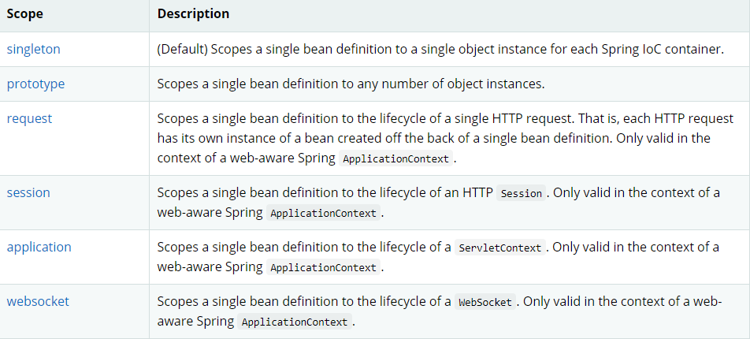
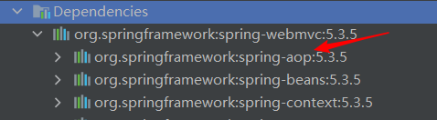
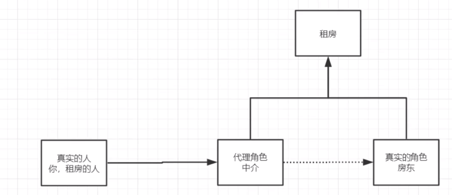
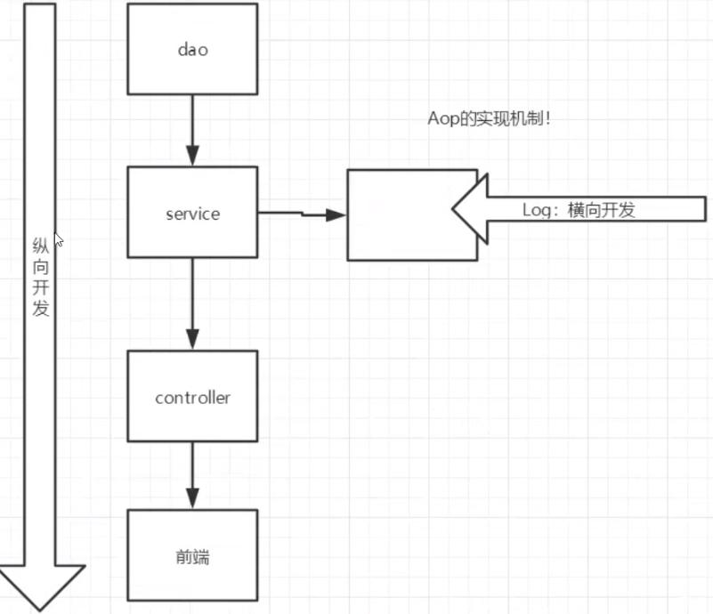
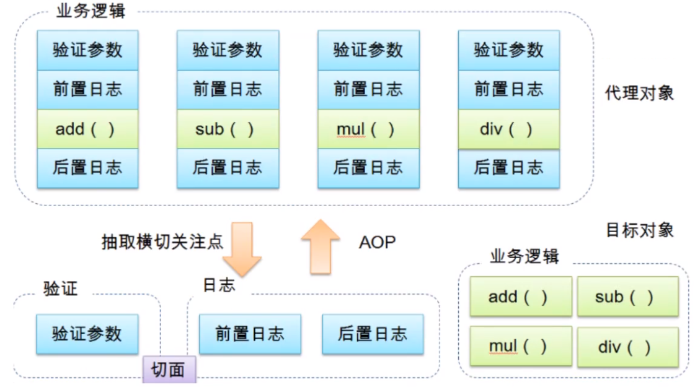
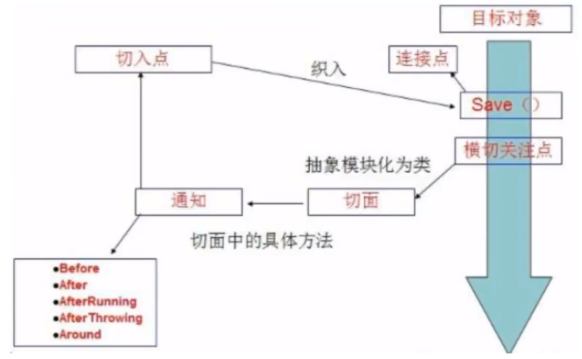
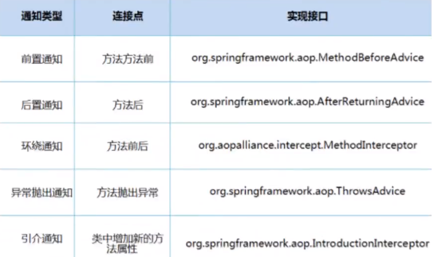

# **IOC理论推导**

UserDao 接口

UserDaoImpl 实现类

UserService 业务接口

UserServiceImpl 业务实现类

```java
private UserDao UserDao;

//利用set动态实现值的输入
public void setUserDao(com.test.dao.UserDao userDao) {
   	this.UserDao = userDao;
}
```

+ 之前是程序主动创建接口，使用set后，程序变成被动的接受对象

## IOC本质

控制反转IOC（inversion of Control），是一种设计思想，DI（依赖注入）是实现IOC的一种方法。

控制反转是一种通过描述（XML或注解）并通过第三方去生产或获取特定对象的方式。在Spring中实现控制反转的是IOC容器，其实现方法是依赖注入（Dependency Injection，DI）。

# IOC对象创建方式

1. 默认使用无参构造方式创建对象

2. 当使用有参构造方式创建对象

   1. 下标赋值
      ```xml
      <!--    第一种，下标赋值！-->
      <bean id="user" class="com.test.pojo.User">
              <constructor-arg index="0" value="testname"/>
      </bean>
      ```
      
   2. 通过类型创建
      ```xml
      <!--第二种方式：通过类型创建    不建议使用此方法-->
      <bean id="user" class="com.test.pojo.User">
   	<constructor-arg type="java.lang.String" value="testname"/>
      </bean>
      ```
      
   3. 参数名

      ```xml
      <!--    第三种：直接通过参数名来设置-->
      <bean id="user" class="com.test.pojo.User">
        	<constructor-arg name="name" value="testname"/>
      </bean>
      ```
总结：在配置文件加载的时候，容器中管理的对象就已经初始化了。

# Spring配置

## 别名

```xml
<!--别名，如果添加了别名，我们也可以使用别名来获取到这个对象-->
<alias name="user" alias="sadasf";//sadasf即为别名
```

## Bean的配置

```xml
<!--
    id：Bean的唯一标识符，也就是相当于我们学的对象名
    class：Bean对象所对应的全限定名：包名+类型
    name：也是别名，而且name可以取多个别名
-->
<bean id="userT" class="com.test.pojo.UserT" name="u1,u2 u3;u4">
	<property name="name" value="testname"/>
</bean>
```

## import

一般为团队开发使用，可以将多个配置文件导入合并为一个

```xml
<import resource="beans1.xml"/>
<import resource="beans2.xml"/>
```

# 依赖注入

## 构造器注入

见上

## set方式注入

+ 依赖注入：Set注入
  + 依赖：Bean对象的创建依赖于容器
  + 注入：Bean对象的所有属性，由容器来注入

【环境搭建】

+ 复杂类型

  ```java
  public class Address {
      private String address;
  
      public String getAddress() {
          return address;
      }
  
      public void setAddress(String address) {
          this.address = address;
      }
  }
  ```

+ 真实测试对象

  ```java
  public class Student {
  
      private String name;
      private Address address;
      private String[] books;
      private List<String> hobbies;
      private Map<String,String> card;
      private Set<String> games;
      private Properties info;
      private String wife;
  }
  ```

+ beans.xml

  ```xml
  <?xml version="1.0" encoding="UTF-8"?>
  <beans xmlns="http://www.springframework.org/schema/beans"
         xmlns:xsi="http://www.w3.org/2001/XMLSchema-instance"
         xsi:schemaLocation="http://www.springframework.org/schema/beans
          https://www.springframework.org/schema/beans/spring-beans.xsd">
  
      <bean id="student" class="com.test.pojo.Student">
  <!--        第一种，普通值注入，直接使用value-->
          <property name="name" value="testname"/>
      </bean>
  </beans>
  ```

+ 测试类

  ```java
  public class MyTest {
      public static void main(String[] args) {
          ApplicationContext context = new ClassPathXmlApplicationContext("beans.xml");
          Student student = (Student) context.getBean("student");
          System.out.println(student.getName());
      }
  }
  ```

+ 完善注入信息

  ```xml
      <bean id="address" class="com.test.pojo.Address">
          <property name="address" value="Earth"/>
      </bean>
      <bean id="student" class="com.test.pojo.Student">
  <!--        第一种，普通值注入，直接使用value-->
          <property name="name" value="testname"/>
  <!--        第二种，Bean注入，ref-->
          <property name="address" ref="address"/>
  <!--        数组-->
          <property name="books">
              <array>
                  <value>book1</value>
                  <value>book2</value>
                  <value>book3</value>
                  <value>book4</value>
              </array>
          </property>
  <!--        List-->
          <property name="hobbies">
              <list>
                  <value>hobbies1</value>
                  <value>hobbies2</value>
                  <value>hobbies3</value>
              </list>
          </property>
  <!--        Map-->
          <property name="card">
              <map>
                  <entry key="ID-Card" value="202104032219"/>
                  <entry key="Date" value="20210404"/>
              </map>
          </property>
  <!--        Set-->
          <property name="games">
              <set>
                  <value>GAME1</value>
                  <value>GAME2</value>
                  <value>GAME3</value>
              </set>
          </property>
  <!--        null-->
          <property name="wife">
              <null/>
          </property>
  <!--        Properties-->
          <property name="info">
              <props>
                  <prop key="Driver">20210402</prop>
                  <prop key="sex">male</prop>
                  <prop key="username">driver</prop>
                  <prop key="password">123456</prop>
              </props>
          </property>
      </bean>
  ```

## 拓展方式注入

可以使用p命名空间和c命名空间进行注入

Beans：

```xml
<beans xmlns="http://www.springframework.org/schema/beans"
       xmlns:xsi="http://www.w3.org/2001/XMLSchema-instance"
       xmlns:p="http://www.springframework.org/schema/p"
       xmlns:c="http://www.springframework.org/schema/c"
       xsi:schemaLocation="http://www.springframework.org/schema/beans
        https://www.springframework.org/schema/beans/spring-beans.xsd">
    
    <!--    p命名空间注入，可以直接注入属性的值:Property-->
    <bean id="user" class="com.test.pojo.User" p:name="testname" p:age="19"/>
<!--    c命名空间注入，通过构造器注入：Construct-args-->
    <bean id="user2" class="com.test.pojo.User" c:age="19" c:name="testname2"/>
    jso
</beans>
```

测试类：

```java
    @Test
    public void test2(){
        ApplicationContext context = new ClassPathXmlApplicationContext("UserBeans.xml");
        User user = context.getBean("user", User.class);
        User user2 = context.getBean("user2", User.class);
        System.out.println(user);
        System.out.println(user2);
    }
```

注意：

p命名空间和c命名空间不能直接使用，需要先导入xml约束

```xml
       xmlns:p="http://www.springframework.org/schema/p"
       xmlns:c="http://www.springframework.org/schema/c"
```

## Bean的作用域



+ 单例模式（Spring默认机制）

  ```xml
      <bean id="user" class="com.test.pojo.User" p:name="testname" p:age="19" scope="singleton"/>
  ```

+ 原型模式:每次从容器中get的时候，都会产生一个新对象

  ```xml
  <bean id="accountService" class="com.something.DefaultAccountService" scope="prototype"/>
  ```

+ 其余的request、session、application、websocket，只能在Web开发中使用到

# Bean的自动装配

+ 自动装配是Spring满足bean依赖的一种方式
+ Spring会在上下文中自动寻找，并自动给bean装配属性

在Spring中有三种装配方式

1. 在xml中显示的配置
2. 在java中显示的配置
3. ==隐式的自动装配bean==

## ByName自动装配

```xml
<!--
    会自动在容器上下文中寻找，和自己对象set方法后面的值对应的bean id
-->
    <bean id="people" class="com.test.pojo.People" autowire="byName">
        <property name="name" value="testname"/>
    </bean>
```

## ByType自动装配

```xml
<!--
    会自动在容器上下文中寻找，和自己对象属性类型相同的bean id
-->
    <bean id="people" class="com.test.pojo.People" autowire="byName">
        <property name="name" value="testname"/>
    </bean>
```

小结：

+ byname的时候，需要保证所有的bean的id唯一，并且这个bean需要和自动注入的属性的set方法的值一致
+ bytype的时候，需要保证所有的bean的class唯一，并且这个bean需要和自动注入的属性的类型一致

## 使用注解自动装配

使用注解须知：

1. 导入约束

2. 配置注解支持

   ```xml
   <?xml version="1.0" encoding="UTF-8"?>
   <beans xmlns="http://www.springframework.org/schema/beans"
       xmlns:xsi="http://www.w3.org/2001/XMLSchema-instance"
       xmlns:context="http://www.springframework.org/schema/context"
       xsi:schemaLocation="http://www.springframework.org/schema/beans
           https://www.springframework.org/schema/beans/spring-beans.xsd
           http://www.springframework.org/schema/context
           https://www.springframework.org/schema/context/spring-context.xsd">
   
       <context:annotation-config/>
   
   </beans>
   ```

   @Autowired

   + 直接在属性上使用即可，也可以在set方式上使用

   + 使用Autowired，我们可以不用编写set方法了，前提是你这个自动装配的属性在IOC（Spring）容器存在，且符合名字byname

如果@Autowired自动装配的环境比较复杂，自动装配无法通过一个注解【@AutoWired】完成的时候，我们可以使用@Qualifier(value = “xxx”)去配合@Autowired的使用，指定一个唯一的bean对象注入

```java
@Autowired
@Qualifier(value = "dog")
private Dog dog;
```

​	@Resource

```java
@Resource
private Cat cat;
@Resource(name = "dog")
private Dog dog;
```

小结：

@Autowired和@Resource的区别

+ 都是用来自动装配的，都可以放在属性字段上
+ @Autowired通过byname方式实现【常用】
+ @Resource默认通过byname方式实现，如果找不到名字，则通过bytype方式实现【常用】
+ 执行顺序不同：@Autowired通过bytype方式实现，@Resource默认通过byname方式实现

# 使用注解开发

在Spring4后，要使用注解开发，必须导入aop的包



使用注解需要导入context的约束，增加注解的支持

@Component：组件，放在类上，说明这个类被Spring管理了，就是bean

1.  bean

2. 属性如何注入

   ```java
   @Component//组件  等价于    <bean id="user" class="com.test.dao.User"/>
   
   public class User {
   
       public String name;
   
       @Value("Volunteer")//相当于        <property name="name" value="Volunteer"/>
       public void setName(String name) {
           this.name = name;
       }
   }
   ```

3. 衍生的注解

   @Component有几个衍生注解，我们在Web开发中，会按照MVC三层架构分层

   + dao【@Repository】
   + service【@Service】
   + controller【@Controller】

   这四个注解功能一样，都是代表将某个类注册到Spring中，装配Bean

4. 自动装配置

   ```xml
   @Autowired：自动装配，通过类型。名字
   	如果@Autowired不能唯一自动装配上属性，则需要通过@Qualifier(value="xxx")
   @Resource：自动装配，通过名字。类型
   ```

5. 作用域

   ```java
   @Component//组件  等价于    <bean id="user" class="com.test.dao.User"/>
   @Scope("prototype")
   public class User {
   
       public String name;
   
       @Value("Volunteer")//相当于        <property name="name" value="Volunteer"/>
       public void setName(String name) {
           this.name = name;
       }
   }
   ```

6. 小结：

   xml与注解：

   + xml更加万能，适用于任何场合，维护简单方便
   + 注解，不是自己的类使用不了，维护相对复杂

   xml与注解最佳实践

   + xml用来管理bean

   + 注解只负责属性的注入

   + 我们在使用过程中，唯一需要注意的问题就是：若要让注解生效，就需要开启注解的支持

     ```xml
     <!--    指定要扫描的包，这个包下的注解就会生效-->
         <context:component-scan base-package="com.test"/>
         <context:annotation-config/>
     ```

# 使用Java的方式配置Spring

配置文件

```java
//这个也会被Spring托管，注册到容器中，因为他本来就是一个@Component
//Configuration代表这是一个配置类，就和我们之前看到的beans.xml一样
@Configuration
@Import(MyConfig2.class)//导入另一个配置类
@ComponentScan("com.test.pojo")
public class MyConfig {

    //注册一个bean，就相当于我们之前写的一个bean标签
    //这个方法的名字就相当与bean标签中的id
    //这个方法的返回值就相当于bean标签的class属性
    @Bean
    public User getUser(){
        return new User();//返回要注入到bean的对象
    }
}
```

实体类

```java
public class User {
    private String name;

    public String getName() {
        return name;
    }

    @Value("Volunteer")
    public void setName(String name) {
        this.name = name;
    }

    @Override
    public String toString() {
        return "User{" +
                "name='" + name + '\'' +
                '}';
    }
}
```

测试类

```java
public class MyTest {

    public static void main(String[] args) {

        //如果完全使用了配置类的方式去做，我们就只能通过AnnotationConfig上下文来获取容器，通过配置类的class对象加载
        ApplicationContext context = new AnnotationConfigApplicationContext(MyConfig.class);
        User getUser = (User) context.getBean("getUser");
        System.out.println(getUser.toString());
        System.out.println(getUser.getName());
    }
}
```

纯Java的配置方式，在SpringBoot中随处可见

# 代理模式

代理模式为SpringAOP的底层

代理模式的分类：

+ 动态代理
+ 静态代理



## 静态代理

角色分析：

+ 抽象角色：一般会使用接口或抽象类来解决
+ 真实角色：被代理的角色
+ 代理角色：代理真实的角色，代理真实角色后，我们一般会做一些附属操作
+ 客户：访问代理对象的人

代理步骤：

+ 接口

  ```java
  public interface Rent {
      public void rent();
  }
  ```

+ 真实角色

  ```java
  public class Host implements Rent {
  
      @Override
      public void rent() {
          System.out.println("House renting");
      }
  }
  ```

+ 代理角色

  ```java
  public class Proxy implements Rent{
      private Host host;
  
      public Proxy() {
      }
  
      public Proxy(Host host) {
          this.host = host;
      }
  
      @Override
      public void rent() {
          host.rent();
      }
  
      public void seeHost(){
          System.out.println("see house");
      }
  
      public void fee(){
          System.out.println("get fee from client");
      }
  
      public void contract(){
          System.out.println("get a contract");
      }
  }
  ```

+ 客户端访问代理角色

  ```java
  public class Client {
      public static void main(String[] args) {
          Host host = new Host();
  //        host.rent();
          Proxy proxy = new Proxy(host);
          proxy.rent();
      }
  }
  ```

代理模式的好处：

+ 可以使真实角色的操作更加纯粹，不用去关注一些公共的业务
+ 公共业务就交给了代理角色
+ 公共业务发生扩展的时候，方便集中管理

缺点：

+ 一个真实角色就会产生一个代理角色，代码量翻倍，开发效率变低

## 加深理解

聊聊AOP




## 动态代理

+ 动态代理的代理类是直接写好的
+ 动态代理两类：基于接口的动态代理，基于类的动态代理
  + 基于接口--JDK动态代理
  + 基于类：cglib
  + java字节码实现：javasist

了解两个类：Proxy：代理，InvocationHandler：调用处理程序


动态代理的好处：

+ 可以使真实角色的操作更加纯粹，不用去关注一些公共的业务
+ 公共业务就交给了代理角色
+ 公共业务发生扩展的时候，方便集中管理
+ 一个动态代理类代理的是一个接口，一般对应一类业务
+ 一个动态代理类可以代理多个类，只要是实现了同一个接口即可

# AOP

## 什么是AOP

AOP（aspect oriented programming）意为：面向切面编程，通过预编译方式和运行期动态代理实现程序功能的统一维护的一种技术方式。AOP是OOP的延续，是软件开发中的一个热点，也是Spring框架中的一个重要内容，是函数式编程的一种衍生范型。利用AOP可以对业务逻辑的各个部分进行隔离，从而使得业务逻辑各部分之间的耦合度降低，提高程序的可重用性，同时提高了开发的效率。



## AOP在Spring中的作用

`提供声明式事务；云溪用户自定义切面`

+ 横切关注点：跨越应用程序多个模块的方法或者功能。即是，与业务逻辑无关的，但是需要关注的部分，就是横切关注点。如日志，安全，缓存，事务等等......
+ 切面（Aspect）：横切关注点被模块化的特殊对象。即，它是一个类
+ 通知（Advice）：切面必须要完成的工作。即，他是类中的一个方法
+ 目标（Target）：被通知对象
+ 代理（Proxy）：项目表对象应用通知之后创建的对象
+ 切入点（PointCut)：切面通知执行的“地点”的定义
+ 连接点（JoinPoint）：与切入点匹配的执行点



SpringAOP中，通过Advice定义横切逻辑，Spring中支持5种类型的Advice：



即AOP在不改变原有代码的情况下，增加了新的功能。

## 使用Spring实现AOP

使用AOP切入，需要导入一个依赖包

```xml
<!-- https://mvnrepository.com/artifact/org.aspectj/aspectjweaver -->
<dependency>
    <groupId>org.aspectj</groupId>
    <artifactId>aspectjweaver</artifactId>
    <version>1.9.6</version>
</dependency>
```

方式一：使用Spring的API接口【主要是SpringAPI接口的实现】

```xml
<!--方式一:使用Spring的API接口-->
<!--    注册bean-->
    <bean id="userService" class="com.Volerde.service.UserServiceImpl"/>
    <bean id="log" class="com.Volerde.log.Log"/>
    <bean id="afterLog" class="com.Volerde.log.AfterLog"/>
    <!--    配置AOP:需要导入AOP约束-->
    <aop:config>
<!--        切入点: expression:表达式,expression(要执行的位置!  * * * * *)-->
        <aop:pointcut id="pointcut" expression="execution(* com.Volerde.service.UserServiceImpl.*(..))"/>
<!--        执行环绕增加!-->
        <aop:advisor advice-ref="log" pointcut-ref="pointcut"/>
        <aop:advisor advice-ref="afterLog" pointcut-ref="pointcut"/>
    </aop:config>
```


方式二：自定义来实现AOP【主要是切面定义】

```xml
<!--    方式二:自定义来实现AOP-->
    <bean id="diy" class="com.Volerde.diyTest.DiyPointCut"/>
    <aop:config>
        <aop:aspect ref="diy">
            <aop:pointcut id="point" expression="execution(* com.Volerde.service.UserServiceImpl.*(..))"/>
            <aop:before method="before" pointcut-ref="point"/>
            <aop:after method="after" pointcut-ref="point"/>
        </aop:aspect>
    </aop:config>
```

方式三：使用注解实现

```xml
<!--    方式三-->
    <bean id="annotationPiontCut" class="com.Volerde.diyTest.AnnotationPiontCut"/>
<!--    开启注解支持-->
    <aop:aspectj-autoproxy/>
```

# 整合Mybatis

步骤:

1. 导入相关jar包
   + Junit
   + Mybatis
   + mysql数据库
   + spring相关
   + aop注入
   + Mybatis-spring[new]
2. 编写配置文件
3. 测试

## 回忆Mybatis

1. 编写实体类

   ```java
   @Data
   public class User {
       private int id;
       private String name;
       private String password;
   }
   ```

   

2. 编写核心文件

3. 编写接口

   ```java
   public interface UserMapper {
       public List<User> selectUser();
   }
   ```

   

4. 编写Mapper.xml

   ```xml
   <?xml version="1.0" encoding="UTF-8" ?>
   <!DOCTYPE mapper
           PUBLIC "-//mybatis.org//DTD Config 3.0//EN"
           "http://mybatis.org/dtd/mybatis-3-mapper.dtd">
   <mapper namespace="com.Volerde.mapper.UserMapper">
       <select id="selectUser" resultType="user">
           select * from mybatis.user;
       </select>
   </mapper>
   ```

   

5. 测试

   ```java
   public class MyTest {
       @Test
       public void test() throws IOException {
           String resource = "mybatis-config.xml";
           InputStream inputStream = Resources.getResourceAsStream(resource);
           SqlSessionFactory sessionFactory = new SqlSessionFactoryBuilder().build(inputStream);
           SqlSession sqlSession = sessionFactory.openSession(true);
   
           UserMapper mapper = sqlSession.getMapper(UserMapper.class);
           List<User> userList = mapper.selectUser();
   
           for (User user : userList) {
               System.out.println(user);
           }
   
       }
   }
   ```

## Mybatis-Spring


有问题，暂时搁置

