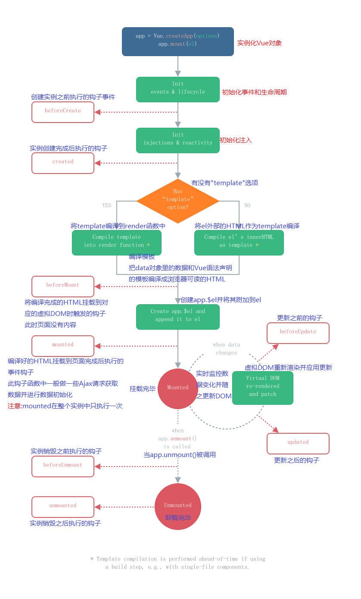

# MVVM模式的实现者

+ Model：模型层，在这里表示JavaScript对象
+ View：视图层，表示DOM（HTML操作的元素）
+ ViewModel：连接视图和数据的中间件，Vue.js就是MVVM中的ViewModel层的实现者

在MVVM架构中，不允许**数据**和**视图**直接通信，只能通过ViewModel来通信，而ViewModel就是定义了一个Observer观察者

+ ViewModel能够观察到数据的变化，并对视图对应的内容进行更新
+ ViewModel能够观察到视图的变化，并能够通知数据发生改变

Vue.js就是MVVM的实现者，它的核心就是实现了DOM监听与数据绑定

# 为什么要是用Vue.js

1. 轻量级，体积小
2. 移动优先，更适合移动端，比如移动端的touch事件
3. 易上手，学习曲线平稳，文档齐全
4. 吸取了Angular（模块化）和React（虚拟DOM） 的长处，并拥有自己的独特功能，比如：计算属性
5. 开源，社区活跃度高

# 第一个Vue

```html
<!--  导入Vue.js-->
  <script src="https://cdn.jsdelivr.net/npm/vue@2.6.14/dist/vue.js"></script>
	or
	<script src="https://unpkg.com/vue@next"></script>
```

```html
<body>
<!--Vue层 模板-->
<div id="app">
  {{massage}}
</div>


<script>
  var vue = new Vue({
    el: "#app",
    //model层：数据
    data:{
      massage: "Hello,Vue!",
    }
  });
</script>
</body>
```

```html
<body>
  <div id="app"></div>
</body>
<script>
  Vue.createApp({ // 创建Vue实例
    template: '<div>Hello World</div>'
  }).mount("#app")
</script>
```

```html
<body>
    <div id="app"></div> 
    <!--每秒加一计数器-->
</body>
<script>
    Vue.createApp({
        data(){
          return {
              counter:1
          }
        },
        mounted(){
            setInterval(()=>{
                this.counter++; // 等于 this.$date.counter +=1;
            })
        },
        template:'<div>{{counter}}</div>' // 插值表达式{{该括号中可以写任意的js表达式}}
        // e.g.{{3 + 1}};{{"Volerde" + ".com"}};{{count > 3 ? true : false}}
    }).mount('#app')
</script>
```


# 基础语法

### 指令

#### v-bind

```html
<html lang="en" xmlns:v-bind="http://www.w3.org/1999/xhtml">
```

```html
<body>
<!--Vue层 模板-->
<div id="app">
  <span v-bind:title="massage">
    鼠标悬停此处几秒，查看此处的动态信息
  </span>
</div>


<script>
  var app = new Vue({
    el: "#app",
    //model层 数据
    data:{
      massage: "Hello!",
    }
  });
</script>
</body>
```

v-bind等被称为指令，指令带有前缀 v-，以表示他们是Vue提供的特殊特性。他们会在渲染的DOM上应用特殊的响应式行为。

在这里，该指令的意思为：“将这个元素节点的title特性和Vue实例的massage属性绑定”。

#### v-if，v-else

```html
<body>
<!--Vue层 模板-->
<div id="vm">
<h1 v-if="type==='A'">YES</h1>
<h1 v-else-if="type==='B'">YES</h1>
<h1 v-else>C</h1>
</div>
<script>
  var vm = new Vue({
    el: "#vm",
    data:{
      type: "A"
    }
  });
</script>
</body>
```

v-show&v-if区别

1. v-show通过控制css样式来控制隐藏显示元素,而v-if则通过重新渲染DOM来控制隐藏显示元素 
2. v-if更加灵活,可以v-if,v-else,v-else-if,进行业务逻辑判断,而v-show则不能进行业务逻辑判断
3. 频繁使用v-if反复进行DOM渲染则会给用户造成卡顿的使用体验

二者选择:

+ 当需要经常切换隐藏显示时,如用户选择隐藏与显示某些元素,使用v-show

#### v-for

```html
<body>
<!--Vue层 模板-->
<div id="array">
  <ul>
    <li v-for="item in items">
      {{item.massage}}
    </li>
  </ul>
</div>
<script>
  let array = new Vue({
    el: "#array",
    data: {
      items: [
        {massage: 'Volerde'},
        {massage: 'SunDog'}
      ]
    }
  });
</script>
</body>
```

```javascript
const app = Vue.createApp({
    data(){
        return {
            listArray:[
                'Ruby',
                'Blake',
                'Yang'
            ],
            listObject:{
                GirlOne:'Ruby',
                GirlTwo:'Blake',
                GirlThree:'Yang'
            }
        }
    },
    methods: {
      handleChangeBtnClick() {
          this.listArray.push('Vue')
      }
    },
    template:`
        <ul>
            <li
                v-for="(item,index) in listArray"
                :key="index+item"
            >
                [{{ index }}]{{ item }}
            </li>
        </ul>
        <button @click="handleChangeBtnClick">Click to change</button>
        <ul>
            <li
                v-for="(value,key,index) in listObject"
                :key="key"
            >
              [{{ index }}]{{ key }}:{{ value }}
            </li>
        </ul>
        <span v-for="number in 99">{{ number }} |</span>
		<!--Vue还可以用于循环数字-
    `
})
app.mount("#app")
```

**v-for循环时**

+ 循环数组: v-for = "(item,index) in listArray"
+ 循环对象: v-for = "(value,key,index) in listObject"

点击按钮时，页面上加了一个新的内容，实际整个列表都被重新渲染了。在实际工作中，这样的代码是不被允许的，它会降低页面的性能，在数据量变多的时候，用户用起来会变的卡顿。

这时，可以加唯一性`key`值，增加后Vue就会辨认出哪些内容被渲染后并没有变化，而只渲染新变化的内容。

```jsx
<ul>
    <li
        v-for="(item,index)  in listArray"
        :key="index+item"
    >
        [{{index}}]{{item}}
    </li>
</ul>
```

官方不建议使用索引`index`为key值，但此时又为了保持唯一性，所以这里使用了`index+item`进行绑定key值

**v-for&v-if优先级对比**

+ 非兼容:二者作用在同一个元素上时,`v-if`会拥有比`v-for`更高的优先级
+ 2.x 版本中在一个元素上同时使用 `v-if` 和 `v-for` 时，`v-for` 会优先作用。
+ 3.x 版本中 `v-if` 总是优先于 `v-for` 生效。

```vue
<ul>
    <template v-for="(value,key,index) in listObject">
      <li
          :key="key"
          v-if="value !== 'Ruby'"
      >
        [{{ index }}]{{ key }}:{{ value }}
      </li>  
    </template>
</ul>
```

故,可以使用如上方法解决v-for&v-if不兼容的问题.<template>标签属于Vue中的业务逻辑标签,不在HTML中进行展示

#### v-html

```html
<script>
    const app = Vue.createApp({
        data(){
            return {
                message: '<i>Hello, world</i>'
            }
        },
        methods: {
          messageChangeClick(){
              this.message = this.message === 'Hello, world' ? 'Vue!' : 'Hello, world'
          }
        },
        template:`
          <div
              @click="messageChangeClick"
              v-html="message"
              v-once
          ></div> 
          <!--使用v-html可以将message中的HTML的标签正常编译出来-->
          <!--v-once使用后,该标签不再改变-->
        `
    });
    app.mount("#app");
</script>
```

#### v-once

v-once这个指令不需要任何表达式，它的作用就是定义它的元素或组件只会渲染一次，包括元素或者组件的所有字节点。首次渲染后，不再随着数据的改变而重新渲染。也就是说使用v-once，那么该块都将被视为静态内容。

### 事件

`v-on`监听事件

事件有vue的事件，前端本身的事件。

```html
<body>
<div id="app">
    <!--v-on绑定click事件-->
    <button v-on:click="sayhi">Click Me</button>
</div>

<script>
  var app = new Vue({
    el: "#app",
    data: {
      massage: "Volerde"
    },
    methods: {//方法必须定义在methods对象中
        sayhi: function(){
          alert(this.massage)
        }
    }
  })
</script>
</body>
```

```html
<body>
	<!--案例-->
    <div id="app"></div>
</body>
<script>
    Vue.createApp({
        data() {
            return {
                message: "",
                showStatus: true
            }
        },
        methods: {
            comeBtnClick() {
                this.message = "ようこそ"
            },
            goBtnClick() {
                this.message = "Long May The Sunshine"
            },
            showStatusBtn() {
                this.showStatus = !this.showStatus
            }
        },
        template:`
                  <div>
                    <button @click="showStatusBtn">show</button>
                    <div v-if="showStatus">{{message}}</div>
                    <button @click="comeBtnClick">come</button>
                    <button @click="goBtnClick">go</button>
                  </div>
                `
    }).mount("#app");
</script>
```


# 双向绑定

### 双向数据绑定

Vue.js是-个MVVM框架，即数据双向绑定，即当数据发生变化的时候，视图也就发生变化，当视图发生变化的时候,数据也会跟着同步变化。这也算是Vue.js的精髓之处了。

值得注意的是，数据双向绑定，一定是对于UI控件来说的，非UI控件不会涉及到数据双向绑定。单向数据绑定是使用状态管理工具的前提。如果我们使用vuex ，那么数据流也是单项的，这时就会和双向数据绑定有冲突。

### 为什么要实现数据的双向绑定

在Vue.js中,如果使用vuex，实际上数据还是单向的，之所以说是数据双向绑定，这是用的UI控件来说，对于我们处理表单，Vue.js的双向数据绑定用起来就特别舒服了。即两者并不互斥,在全局性数据流使用单项，方便跟踪;局部性数据流使用双向，简单易操作。

### 在表单中使用数据双向绑定

可以用`v-model`指令在表单<input>、<textarea> 及<select> 元素上创建双向数据绑定。它会根据控件类型自动选取正确的方法来更新元素。尽管有些神奇，但v-model本质上不过是语法糖。它负责监听用户的输入事件以更新数据，并对一些极端场景进行一些特殊处理。

**`v-model`会忽略所有表单元素的value、checked、 selected特性的初始值而总是将Vue实例的数据作为数据来源。应该通过JavaScript在组件的data选项中声明初始值!**

输入实时显示

```html
<div id="app">
    <input type="text" v-model="massage">{{massage}}
</div>

<script>
  var app = new Vue({
    el: "#app",
      data: {
        massage:""
      }
  })
```

单选内容显示

```html
<body>
<div id="app">
    sex:
    <input type="radio" name="sex" value="man" v-model="massage"> man
    <input type="radio" name="sex" value="woman" v-model="massage"> woman
    
    <p>
        checked:{{massage}}
    </p>
</div>

<script>
  var app = new Vue({
    el: "#app",
      data: {
        massage:''
      }
  })
</script>
</body>
```

复选框显示

```html
<body>
<div id="app">
    <select v-model="selected">
        <option value="" disabled>--请选择--</option>
        <option>A</option>
        <option>B</option>
        <option>C</option>
        <!--为支持iOS多端适配，加入一个属性为disable的选项-->
    </select>

    <p>
        checked:{{selected}}
    </p>
</div>

<script>
  var app = new Vue({
    el: "#app",
      data: {
        selected:''
      }
  })
</script>
</body>
```

```vue
const app = Vue.createApp({
    data(){
        return {
            message:'',
            check:false,
            checked:[],
            witchOne:''
        }
    },
    template:`
        <div>
            {{ message }}
            <input type="text" v-model="message">
            <textarea v-model="message" />
            <!--Vue3实现了使用单个textarea＋v-model的形势来进行数据绑定-->
            <div>
              {{ check }}<input type="checkbox" v-model="check">
            </div>
            <div>
                {{ checked }}
                Ruby<input type="checkbox" v-model="checked" value="Ruby">
                Blake<input type="checkbox" v-model="checked" value="Blake">
                Yang<input type="checkbox" v-model="checked" value="Yang">
                <!--多选，checked为数组形式变量，被选中的标签的value值通过v-model绑定到checked中-->
            </div>
            <div>
                {{ witchOne }}
                Ruby<input type="radio" v-model="witchOne" value="Ruby">
                Blake<input type="radio" v-model="witchOne" value="Blake">
                Yang<input type="radio" v-model="witchOne" value="Yang">
                <!--单选，使用v-model绑定withOne变量，当被选中时，withOne的值改为选中的标签的value值-->
            </div>
        </div>
    `
}).mount("#app")
```
**注意:如果`v-model`表达式的初始值未能匹配任何选项，<select> 元素将被渲染为"未选中”状态。在iOS中，这会使用户无法选择第一个选项。因为这样的情况下，ios 不会触发change事件。因此,更推荐像上面这样提供一个值为空的禁用选项。**

```vue
    Vue.createApp({
        data(){
            return {
                list:['Ruby', 'Blake', 'yang'],
                name:""
            }
        },
        methods: {
          handleAddCharacter() {
              this.list.push(this.name);
              this.name = '';
          }
        },
        template:`
          <div>
            <button @click="handleAddCharacter">Add Character</button>
            <input type="text" v-model="name"/>
          <ul>
              <li v-for="(item,index) of list"><{{index+1}}>{{item}}</li>
              <!--()中的顺序不能改变-->
            </ul>
          </div>
        `
    }).mount("#app");
```

```vue
const app = Vue.createApp({
    data(){
        return {
            checked: false,
            name:'Unchecked'
        }
    },
    template:`
        <div>
            <div>
                {{ checked }}
                <input
                    type="checkbox"
                    v-model="checked"
                >
            </div>
            <div>
                {{ name }}
                <input
                    type="checkbox"
                    v-model="name"
                    true-value="Hello, world!"
                    false-value="Vue!"
                >
                <!--通过使用true-value&false-value来绑定选中与未选中时此标签的值，代替了默认的值“true&false”-->
            </div>
        </div>
    `
})
app.mount("#app")
```

### 表单双向绑定中的修饰符

```vue
const app = Vue.createApp({
    data(){
        return {
            checked: false,
            name:'Unchecked',
            message:''
        }
    },
    template:`
        <div>
            <div>
                {{ checked }}
                <input
                    type="checkbox"
                    v-model="checked"
                >
            </div>
            <div>
                {{ name }}
                <input
                    type="checkbox"
                    v-model="name"
                    true-value="Hello, world!"
                    false-value="Vue!"
                >
            </div>
            <div>
                <input type="text" v-model.lazy="message">
                <!--lazy修饰符，只有在标签失去焦点时数据才会变化-->
                {{ message }}
                {{ typeof message}}
              <!--typeof message显示当前的message的类型-->
                <input type="text" v-model.number="message">
              <!--输入框中的默认为string字符串类型，number修饰符可以将输入的数字转换为number类型-->
                <input type="text" v-model.trim="message">
                <!--自动将输入框中的空格取消-->
            </div>
        </div>
    `
})
app.mount("#app")
```

# 组件

### 组件初识

组件是可复用的vue实例，就是一组可以重复使用的模板，和JSTL的自定义标签、Thymeleaf的`th:fragment`等框架有异曲同工之妙。通常，一个应用会以一棵嵌套的组件树的形式来组织


组件编写：

```html
<body>
<div id="app">
    <my-first-component v-for="item in items" v-bind:target="item"></my-first-component>
    <!--v-bind:targetのtarget相当于绑定了target,item则相当于实参-->
</div>

<script>
    // 定义Vue组件component
    Vue.component("my-first-component",{
        // 使用props属性传递参数，props的参数默认不能大写
        props:['target'],// props这里的"target"相当于方法＋形参
        template:'<li>{{target}}</li>'// 相当于将形参的内容显示出来
    })

  let app = new Vue({
    el: "#app",
      data: {
        items:['JAVA','JAVASCRIPT','LINUX']
      }
  })
</script>
</body>
```

+ `Vue-component()`:注册组件
+ `my-first-component`:自定义组件名
+ `template`:组件模板
+ `v-for="item in items"`:遍历Vue实例中定义的名为`items`的数组，并创建同等数量的组件
+ `v-bind:target="item"`：将遍历的item项绑定到组件中`props`定义的名为`target`的属性上；`=`左边的`target`为`props`定义的属性名，右边为`item in items`中遍历的item项的值

```html
<body>
<div id="app"></div>
</body>
<script>
    const app = Vue.createApp({
        data(){
            return {
                list:['Ruby', 'Blake', 'yang'],
                name:""
            }
        },
        methods: {
            handleAddCharacter() {
                this.list.push(this.name);
                this.name = '';
            }
        },
        template:`
          <div>
            <myTitle/>
            <button @click="handleAddCharacter">Add Character</button>
            <input type="text" v-model="name"/>
          <ul>
              <myCharacters
                v-for="(item,index) of list"
                v-bind:item="item"
                v-bind:index="index+1"
              />
              <!--()中的顺序不能改变-->
            </ul>
          </div>
        `
    })
    app.component('myTitle',{
        template:`<h1 style="text-align:center">rwby</h1>`
    })
    app.component('myCharacters',{
        props: ['index', 'item'],
        template:`
            <li><{{index}}>{{item}}</li>
        `
    })
    app.mount("#app");
</script>
```

### 组件集

#### 全局组件定义和复用性

**全局组件**定义

```vue
const app = Vue.createApp({
    template:`
        <Website />
        <Description />
    `
});
app.component('Website',{
    template:`
        <h2>Hello World</h2>
    `
})
app.component('Description',{
    template:`
        <div>Vue</div>
    `
})
const vm = app.mount("#app");
```

全局组件

+ 优
  + 定义在全局中，在任何地方都可以使用，方便简单
+ 缺
  + 需要加载完全部全局组件才能打开界面，因此网页打开会变慢
  + 当页面加载有就一直存在，会对性能产生一定影响

**复用性**

每个组件单独运行，互不干扰

```vue
const app = Vue.createApp({
    template:`
        <Website />
        <Description />
        <count />
        <count />
        <count />
		<!--三个count互不干扰，彼此独立运行-->
    `
});
app.component('Website',{
    template:`
        <h2>Hello World</h2>
    `
})
app.component('Description',{
    template:`
        <div>Vue</div>
    `
})
app.component('count',{
    data(){
        return {
            count:'0'
        }
    },
    template:`
        <div @click="count++">
            {{ count }}
        </div>
    `
})
const vm = app.mount("#app");
```

#### 局部组件创建和注册方法

局部组件需要注册才能使用

> 通过此处进行局部组件的创建

```vue
const count = {
    data(){
        return {
            count:0
        }
    }, 
    template:`
        <div @click="count++">
            {{ count }}
        </div>
    `
}
```

>  通过此处进行局部组件的注册，此为简写法

```vue
const app = Vue.createApp({
    components:{count},
    template:`
        <Website />
        <count />
    `
});
```

> 通过键值对进行注册

```vue
const app = Vue.createApp({
    components:{
		click-add-one:count
	},
    template:`
        <Website />
        <click-add-one />
		<!--需要注意的是，对于驼峰命名法有潜规则为：采用键值加横杠的形式，如“click-add-one”-->
    `
});
```

#### 父子组件的静态和动态传值

静态传值

```vue
    const app = Vue.createApp({
        template:`
            <div>Vue</div>
            <son name="Vue" />
        `
    });
    app.component('son',{
        props:['name'],
        template:`
            <div>{{ name }} div</div>
        `
    })
    const vm = app.mount("#app");
```

+ 父组件使用name关键字将值传给子组件，子组件通过props以数组的形式绑定name关键字，并在模板中{{name}}应用
+ 静态传值只能传字符串类型的值


动态传值

```vue
const app = Vue.createApp({
    data(){
        return {
            name:'Hello, world'
        }
    },
    template:`
        <div>Vue</div>
        <son :name="name" />
    `
});
app.component('son',{
    props:['name'],
    template:`
        <div>{{ name }} div</div>
    `
})
const vm = app.mount("#app");
```

+ 使用v-bind绑定父组件中的name属性，在data（）中定义name

+ 动态传值可以传非字符串类型的值

+ 动态传值可以传入函数

  ```vue
      const app = Vue.createApp({
          data(){
              return {
                  name:'Hello, world',
                  pay:()=>{
                      alert("Long May The Sunshine")
                  }
              }
          },
          template:`
              <div>Vue</div>
              <son :name="name" :pay="pay" />
          `
      });
      app.component('son',{
          props:['name','pay'],
          methods:{
              handleClick() {
                  alert("money money money")
                  this.pay()
              }
          },
          template:`
              <div @click="handleClick">{{ name }} div</div>
          `
      })
      const vm = app.mount("#app");
  ```

  使用v-bind:pay=“pay”绑定data（）中的pay函数，子函数中，用props接收pay

#### 组件传值的校验

对传入的值的类型进行校验

```vue
    app.component('son',{
        props:{ // 不使用数组形式，而是使用对象的形式对传入的值进行校验
            name:String, // 类型的校验 支持 Sting Boolean Array Object Function Symbol
        },
        template:`
            <div>{{ name }}</div>
        `
    })
```

同时进行类型与非空等多个校验

```vue
    app.component('son',{
        props:{
            name:{
                type:String, // 类型判断
                required:true // 非空判断
				default:'Volerde' // 默认值
				validator:function(value){
					// 任意逻辑代码
					return value.search("Volerde") != -1 // search：JavaScript查找是否出现“Volerde”，返回值为起始下标
     			}
            },
        },
        template:`
            <div>{{ name }}</div>
        `
    })
```

使用{}，以对象的形式进行多个校验

#### 单向数据流机制


# createApp()和mount()方法

```html
<body>
<div id="app"></div>
</body>
<script>
    const app = Vue.createApp({ // 此花括号为参数
        data(){
          return {
              message:'Vue'
          }
        },
        template:`
          <div>{{message}}</div>
        `
    })

    const vm = app.mount("#app") // 挂在app实例
    console.log(vm) // MVVM     M->model    V->view     VM->ViewModel   数据视图连接层
</script>
```

# 生命周期

Vue实例有一个完整的生命周期，也就是从开始创建、初始化数据、编译模板、挂载DOM、渲染-->更新-->渲染、卸载等一系列过程，我们称这是Vue的生命周期。即Vue实例从创建到销毁的过程，就是生命周期。

在Vue的生命周期内，它提供了一些列的事件，可以让我们在事件触发时创建JS方法，可以让我们创建的JS控制整个大局，让这些方法响应中的this指向的是Vue的实例。



```html
<body>
  <div id="app"></div>
</body>
<script>
  // 生命周期函数->在某些时刻会自动执行的函数
  const app = Vue.createApp({
    data(){
      return {
        message: 'Hello World!'
      }
    },
    methods: {
      handleItemClick(){
        this.message = this.message === 'Hello World!' ? 'Vue' : 'Hello World!';
      }
    },
    beforeCreate(){
      console.log("beforeCreate,在实例生成之前会自动执行的函数")
    },
    created(){
      console.log("created,实例生成之后会自动执行的函数")
    },
    beforeMount(){
      console.log("beforeMount,在模板渲染完成之前执行的函数")
    },
    mounted(){
      console.log("mounted,在模板渲染完成之后执行的函数")
    },
    beforeUpdate(){
      console.log("beforeUpdate,在更新前")
      console.log(document.getElementById('app').innerHTML) // 打印出来为Hello World,为改变之前的值
      // console.log(this.message) // 此处不得使用console.log打印this.message   会报错,原因未知->待解决
    },
    updated(){
      console.log("updated,在更新后")
      console.log(document.getElementById('app').innerHTML) // 打印出来为Vue,为改变之后的值
      // console.log(this.message) // 此处不得使用console.log打印this.message   会报错,原因未知->待解决
    },
    beforeUnmount(){
      console.log("beforeUnmount,在VUe应用卸载完成前执行的函数")
      console.log(document.getElementById('app').innerHTML) // 能打印出来结果

    },
    unmounted(){
      console.log("unmounted,在Vue应用卸载完成后执行")
      console.log(document.getElementById('app').innerHTML) // 打印不出来,结果为空

    },
    template:'<div @click="handleItemClick">{{message}}</div>'
  })
  app.mount("#app")
</script>
```

# 模板

### 动态参数和阻止默认事件

```javascript
    const app = Vue.createApp({
        data() {
            return {
                message: 'Volerde',
                name: 'title2',
                event: 'click'
            }
        },
        methods: {
            alertClick() {
                alert("Long May The Sunshine")
            },
            handleClick() {
                alert("Vue")
            }
        },
        template: `
          <div
              v-bind:title="message"
              v-on:[event]="alertClick"
          >
          {{ message }}
          </div>
          <!--v-bind:title&v-on:click均可以简写,以下为简写方式-->
          <div
              :[name]="message"
              @click="alertClick"
          >
          {{ message }}
          </div>
          <form action="https://www.volerde.space" @click.prevent="handleClick">
            <button type="submit">submit</button>
          </form>
          <!--此处name&event为data中的name&event-->
        `
    })
    app.mount("#app")
```

### 条件判断

使用三目运算符进行判断,从而改变class

```html
<script>
    const app = Vue.createApp({
        data() {
            return {
                message: 'Hello, world'
            }
        },
        methods: {
            messageChangeClick() {
                this.message = this.message === 'Hello, world' ? 'Vue!' : 'Hello, world'
            }
        },
        template: `
          <div
              @click="messageChangeClick" :class="message === 'Hello, world' ? 'one' : 'two'"
          >
              {{ message }}
          </div>
        `
    });
    app.mount("#app");
</script>
<style>
    .one {
        color: red
    }

    .two {
        color: green
    }
</style>
```

### 样式绑定

```html
<style>
    .color-red {
        color:red !important;
    }
    .color-green {
        color:green
    }
    .background-color-orange {
        background-color:orange
    }
</style>
<script>
    const app = Vue.createApp({
        data(){
          return { // 通过定义变量来操控css样式
              colorSelect:"color-red", // 直接使用字符串控制css
              colorObject:{ // 使用对象来控制css
                  'color-red':false,
                  'background-color-orange':true
              },
              colorArray:[ // 使用数组＋嵌套对象的方式
                  'color-green',
                  'background-color-orange',
                  {
                      'color-red':true
                  }
              ]
          }
        },
        methods:{
          colorChange() {
            this.colorSelect = this.colorSelect === "color-red" ? "color-green" : "color-red";
          }
        },
        template:`
            <h2
                @click="colorChange"
                :class="colorArray"
            >
                Volerde
            </h2>
        `
    }).mount("#app")
</script>
```

```javascript
    const app = Vue.createApp({ // createApp生成的一般叫做父组件
        template:`
            <DIYComponent />
        `
    })
    app.component('DIYComponent',{ // 被调用的,一般称为子组件
        template:`
            <div>So,now you can see this component</div>
        `
    })
    app.mount("#app")
```

**子组件的坑:**

修改一下子组件，再写一个`<div>`进去，里边写上`Vue`

```jsx
app.component('sonCom',{
    template:`
        <div>SonCom</div>
        <div>VUe</div>
    `
})
```

结果:两个`<div>`的样式都不起作用了.

解决方法:在两个并列的`<div>`外层，加上一个包括性的标签就可以了.即让子组件的最外层只有一个根元素。

```jsx
app.component('sonCom',{
    template:`
        <div>
            <div>SonCom</div>
            <div>Vue</div>
        </div>
    `
})
```

### 行内样式

```javascript
const app = Vue.createApp({
    data(){
        return {
            styleString:'color:orange', // 字符串形式
            styleObject:{ // 对象样式
                color: 'orange',
                background:'yellow'
            }
        }
    },
    template:`
        <div :style="styleObject">Volerde</div>
        <!--通过v-bind:style来绑定行内css样式-->
    `
})
app.mount("#app")
```

# 计算属性

### 什么是计算属性

计算属性的重点突出在属性二字上，首先是属性，其次是计算的能力，此计算为一个函数：即这是一个能够将计算结果缓存起来的一个属性，暂且可以理解为缓存

计算属性的特性,当计算属性以来的内容发生改变时,才会重新计算

```javascript
    const app = Vue.createApp({
        data(){
            return {
                message:'Hello, world',
                price:10,
                count:2
            }
        },
        computed:{ // 计算属性,当计算属性以来的内容发生改变时,才会重新计算
        // 当首次渲染页面时,也会计算一遍属性
            total(){
              return this.price * this.count // 计算属性必须返回一个值
            }
        },
        methods:{
            messageChangeClick(){
                this.message = this.message === 'Hello, world' ? 'Vue!' : 'Hello, world'
            },
            getTotal(){ // 只要页面重新渲染,就会重新执行此方法
                return this.price * this.count
            },
            addCount(){
                this.count++
            }
        },
        template:`
            <h2 @click="messageChangeClick">{{ message }}</h2>
            <div>{{ total }}</div>
            <div>{{ getTotal() }}</div>
            <button @click="addCount">get one</button>
        `
    });
    app.mount("#app");
```

# 侦听器(监听器)-watch

```javascript
const app = Vue.createApp({
    data(){
        return {
            price:10,
            count:2
        }
    },
    watch:{ // 当监听的值发生改变时调用
        // 与computed的区别:computed在首次进入页面时会调用一次,而watch只有在监听的数值改变时才会调用
        count(current,prev){ // 监听哪个值,就写哪个值对应的方法
            // 监听器可以不用返回值
            console.log("count changed")
            console.log("现在的值:"+current+"\n"+"以前的值:"+prev)
        }
    },
    computed:{
        total(){
            return this.price * this.count
        }
    },
    methods:{
        addCount(){
            this.count++
        }
    },
    template:`
        <div>{{ total }}</div>
        <button @click="addCount">get one</button>
    `
});
app.mount("#app");
```

**method,watch,computed三者使用的优先级**

当三者可以实现某个具体的功能时,他们的优先级

+ `computed`和`method`都能实现的功能,建议使用`computed`,因为有缓存,不用渲染页面就刷新
+ `computed`和`watch`都能实现的功能,建议使用`computed`,因为更加简洁

# 绑定事件

### 方法和参数

```javascript
const app = Vue.createApp({
    data(){
        return {
            count:0
        }
    },
    methods: {
        addCountClick(num,event) {
            this.count+=num
            console.log(event.target)
        },
        alertBtnClick1(){
            alert(1)
        },
        alertBtnClick2(){
            alert(2)
        }
    },
    template:`
      <div>{{ count }}</div>
      <button @click="addCountClick(2,$event)">Click</button>
      <button @click="count++">Click</button><!--可以直接用表达式-->
      <button @click="alertBtnClick1(),alertBtnClick2()"></button>
    `
})
app.mount("#app")
```

@click="addCountClick(2,$event)"

+ 无参数时,写为addCountClick,不用加括号,且在methods中的方法加入参数event即可传入event
+ 有参数时,写为addCountClick(参数1,参数2...),需要传入event时需用"$",写为"\$event"
+ 要触发两个事件时,用","隔开,并**需要加上()**

### 事件修饰符

>  冒泡事件			.stop

```vue
template:`
    <div @click="alertBtnClick">
        <div>{{ count }}</div>
        <button @click="addCountClick">Click</button>
    </div>
`
```

当点击button时,程序会向上冒泡,先触发addCountClick事件,然后触发alertBtnClick事件

**解决方法:@click后面加上.stop阻止冒泡事件**

```vue
template:`
    <div @click="alertBtnClick">
        <div>{{ count }}</div>
        <button @click.stop="addCountClick">Click</button>
    </div>
`
```

> .self

```vue
template:`
    <div @click.self="alertBtnClick">
        点击本元素才会触发.self,即alertBtnClick事件只会响应本元素的触发,不会响应子元素的触发
        <div>{{ count }}</div>
        <button @click.stop="addCountClick">Click</button>
    </div>
`
```

> .prevent

```vue
        template:`
          <form action="https://www.volerde.space" @click.prevent="handleClick">
            <button type="submit">submit</button>
          </form>
        `
```

阻止默认事件的发生

> .capture

```vue
template:`
    <div @click.capture="alertBtnClick">
        <div>{{ count }}</div>
        <button @click="addCountClick">Click</button>
    </div>
`
```

.capture和冒泡事件正好相反,冒泡事件是先执行字元素中的事件,再执行父元素的事件;而.capture则是先执行父元素的事件,再去执行子元素的事件

> .once

```vue
template:`
    <div @click="alertBtnClick">
        <div>{{ count }}</div>
        <button @click.once="addCountClick">Click</button>
    </div>
`
```

.once只会使事件在第一次执行时成功,此后则会阻止事件发生,即只能点击一次

> .passive
>
> passive主要用在移动端的scroll事件，来提高浏览器响应速度，提升用户体验。因为passive=true等于提前告诉了浏览器，touchstart和touchmove不会阻止默认事件，手刚开始触摸，浏览器就可以立刻给与响应；否则，手触摸屏幕了，但要等待touchstart和touchmove的结果，多了这一步，响应时间就长了，用户体验也就差了。

### 按键与鼠标修饰符

> 按键修饰符

```vue
template:`
    <div>
        <input @keydown.enter="handleKeyDown">
    </div>
`
// 按键修饰符    enter    tab    delete    esc    up    down    left    right
```

> 鼠标修饰符

```vue
template:`
    <div>
        <div @click.right="handleKeyDown">Click with right</div>
    </div>
`
// 鼠标修饰符    left    right    middle 
```


# Axios异步通信

Axios是一个开源的可以用在浏览器端和NodeJS的异步通信框架，它的主要作用就是实现Ajax异步通信

功能特点：

+ 从浏览器中创建`XMLHttpRequests`
+ 从NodeJS中创建http请求
+ 支持PromiseAPI[JS中链式编程]
+ 拦截请求和相应
+ 转换请求数据和响应数据
+ 取消请求
+ 自动转换JSON数据
+ 客户端支持防御XSRF(跨站请求伪造)

### 为什么使用Axios

`Vue.js`是一个视图层框架，并且作者(尤雨溪)严格遵守SoC(关注度分离原则)，所以`Vue.js`不包括AJAX通信功能。为了解决通信问题，作者单独开发了一个名为`vue-resource`的插件，不过在进入2.0版本后停止了对该插件的维护，并推荐使用`Axios`框架。少用jQuery，因为它操作DOM太频繁。

### 第一个Axios应用程序

开发的接口大部分采用JSON格式，创建一个data.json的文件，并填入以下内容，放在项目的根目录下

```json
{
  "name": "Volerde",
  "url": "http://www.volerde.space",
  "page": 1,
  "isNoProfit": true,
  "address": {
    "street": "灵川",
    "city": "桂林",
    "country": "China"
  },
  "links": [
    {
      "name": "bilibili",
      "url": "http://www.bilibili.com"
    },
    {
      "name": "狂神说JAVA",
      "url": "http://www.kuangstudy.com"
    },
    {
      "name": "baidu",
      "url": "http://www.baidu.com"
    }
  ]
}
```

```html
<body>

<div id="app" v-cloak>
    <div>
        {{info.name}}
    </div>
    <a v-bind:href="info.url">Click Me</a>
</div>
<script src="https://cdn.jsdelivr.net/npm/vue/dist/vue.js"></script>
<script src="https://unpkg.com/axios/dist/axios.min.js"></script>
<script>
    var vm = new Vue({
        el:'#app',
        data(){
            return{
                // 请求的返回字符串格式必须和JSON字符串中的一样,貌似可以自动对整格式
                info:{}
            }
        },
        mounted(){// 钩子函数，链式编程 基于ES6的箭头函数编写
            axios.get('../data.json').then(response=>(this.info=response.data));
            axios.get('../data.json').then(function (response){// 无箭头函数版
                this.info=response.data;
            });
        }
    });
</script>
</body>
```

实例：

1. 在这里使用v-bind将a:href的属性值与Vue实例中的数据进行绑定
2. 使用Axios的get方法请求Ajax并自动将数据封装进了Vue实例的数据对象中
3. 在data中的数据结构必须要和Ajax响应回来的数据结构匹配