# 1.与表格有关的标签

## 1.样式

<table>
    <tr>
        <td>列1</td>
        <td>列2</td>
    </tr>
</table>

或者

<table>
    <tr>
        <th>表头列1</th>
        <th>表头列2</th>
    </tr>
</table>

## 2.属性

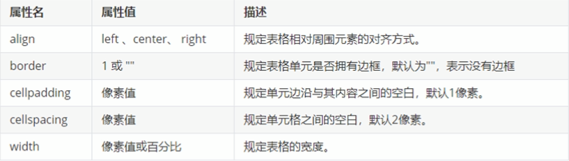

**align设置表格位置**

left 靠左

center 居中

right 靠右
**border表格格线后接的数字代表像素**

**cellspacing 表格格线的像素**

**cellpadding 表格与内容之间的空白**

**width 表格宽度**

**height 表格高度**

<thead> 表头区域

<tbody> 表身区域

## 3.表格的合并

**rowspan 跨行合并**

**colspan 跨列合并**

# 2.列表标签

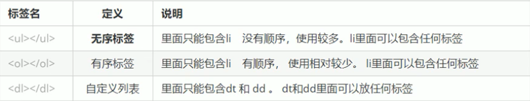

## 1.无序标签

<ul>
    <li>列表1</li>
    <li>列表2</li>
    <li>列表3</li>
</ul>

## 2.有序标签

<ol>
    <li>列表项1</li>
    <li>列表项2</li>
    <li>列表项3</li>
</ol>

## 3.自定义标签

<dl>
    <dt>名词1</dt>
    <dd>解释1</dd>
    <dd>解释2</dd>
</dl>

# 3.表单标签

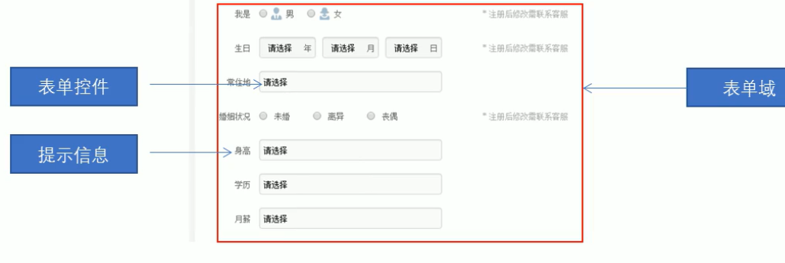

## 1.格式

<form action="url地址" method="get/post" name="表单域名称">
各种表单元素控件
    <input type="属性值"
</form>

## 2.各属性

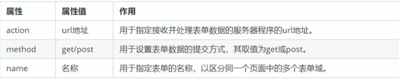

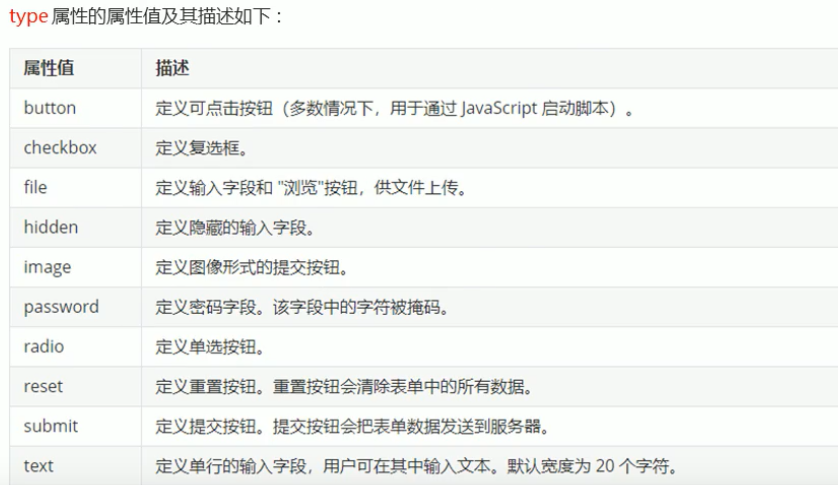

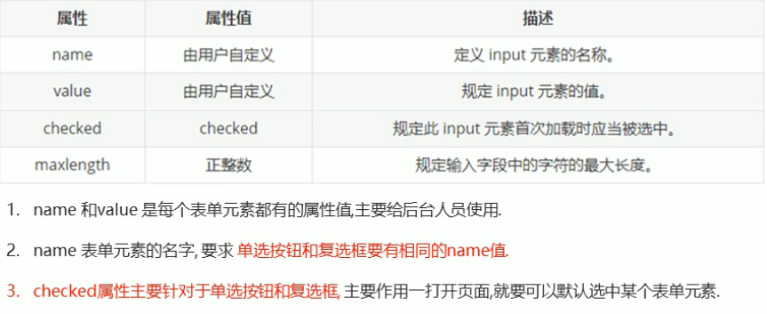

# 4.css初

## **1.简介**

CSS是层叠样式表的简称，也叫CSS样式表或级联样式表。同时CSS也是一种标记语言。

## **2.功能**

主要用于设置HTML中的文本内容（字体，大小，对齐方式等），图片的外形（宽高，边框样式，边距等）以及版面的布局和外观显示样式。

## **3.用法**

<head>
    
</head>
### 类选择器

e.g.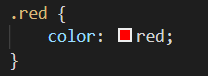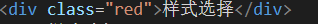

 

只可以被调用一次

e.g.

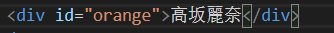

## 4.总结

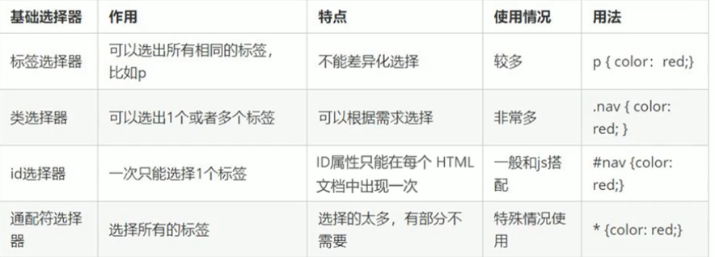

# 5.CSS字体

## 1.文本字体属性

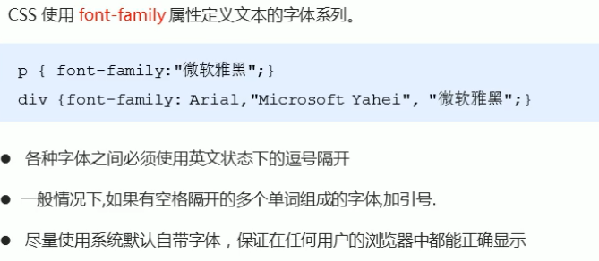

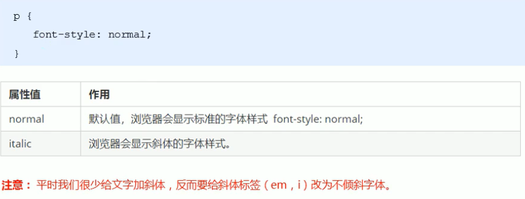

## 2.文字复合属性

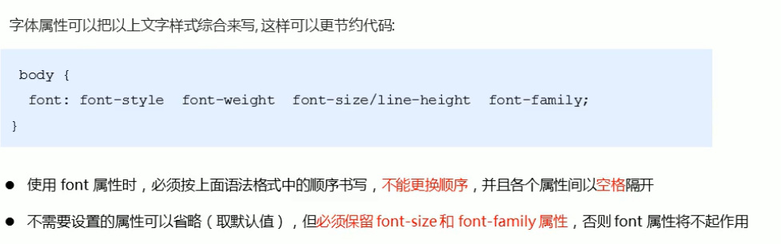

## 3.小结

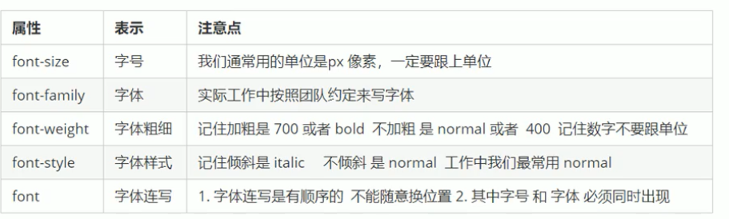

## 4.装饰文本

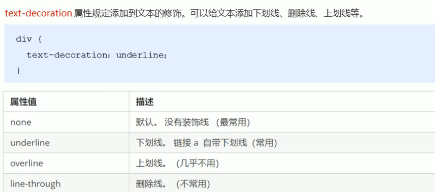

# 6.Emmet语法

## 1.快速生成HTML结构语法

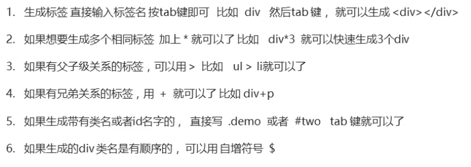

## 2.css的复合选择器

### 1.后代选择器

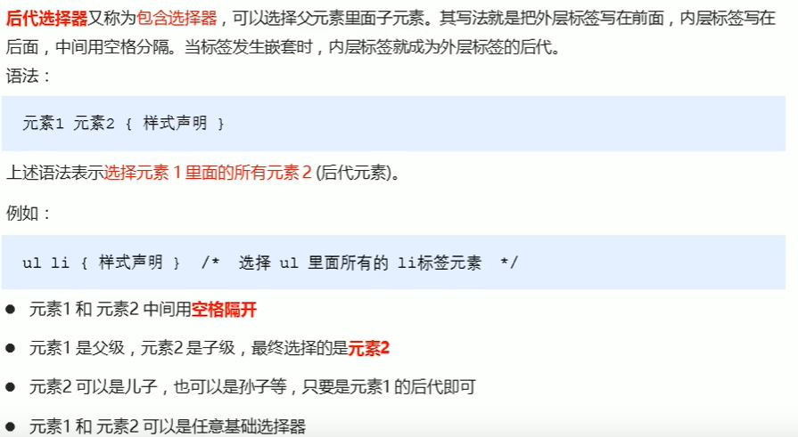

### 2.子元素选择器

元素1>元素2 { 样式声明}

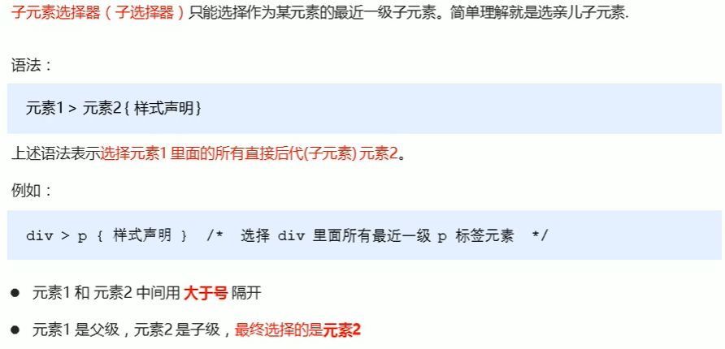

### 3.并集选择器

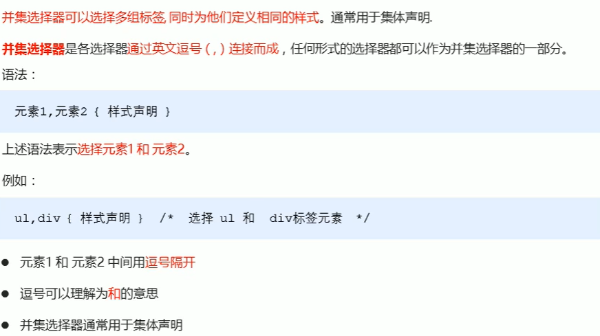

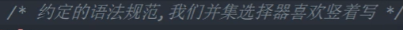

e.g.

元素1，

元素2，

元素3 {样式声明}

### 4.伪类选择器

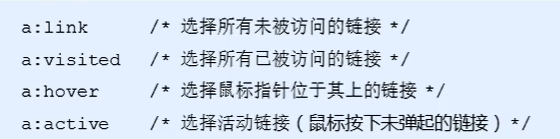

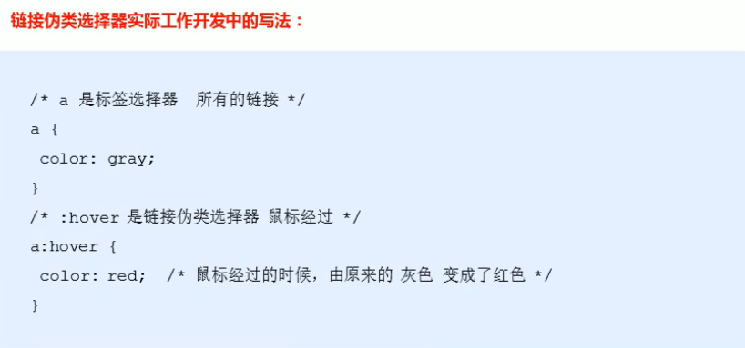

###  5.focus伪类选择器

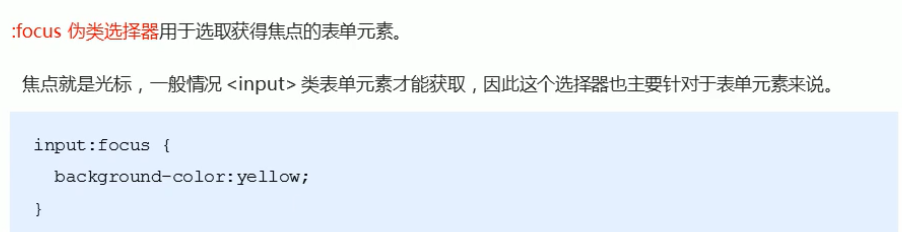

### 6.复合选择器总结

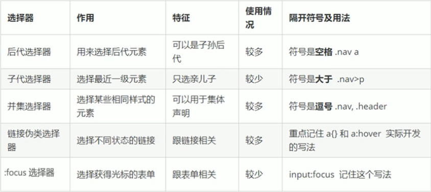

## 3.css的元素

### 1.块元素

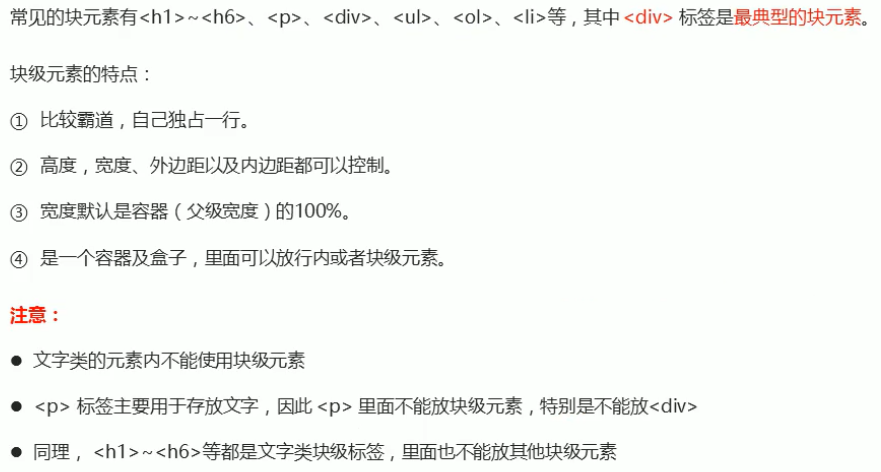

### 2.行内元素

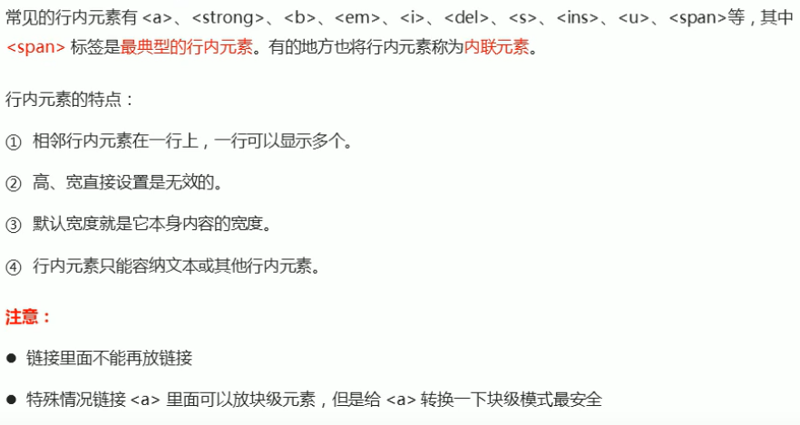

### 3.行内块元素

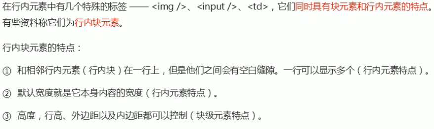

### 4.总结

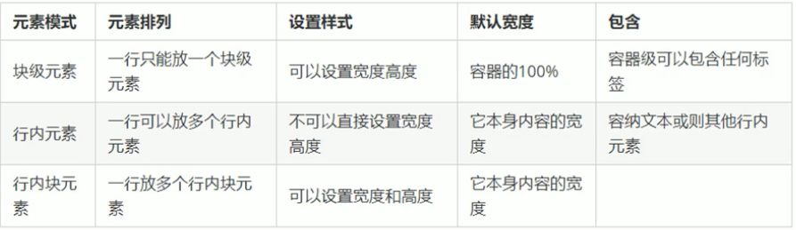

### 5.显示模式的转换

转换为块元素 display: block

转换为行内元素 display: inline

转换为行内块元素 display: inline-block

## 4.css的背景

### 1.背景颜色

background-color：颜色

background-color: transparent **背景颜色透明**

### 2.背景图片

格式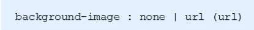

**默认情况下背景图片平铺**

### 3.背景平铺

如果需要在HTML页面上对背景图片进行平铺，可以使用background-repeat属性。

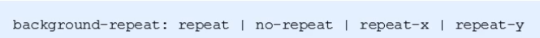

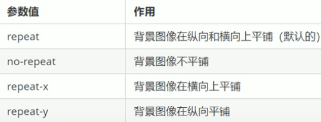

### 4.**背景图片的位置控制**

利用background-position可以改变背景图片的位置

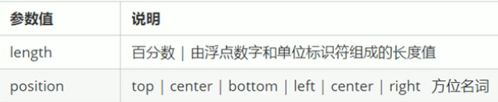

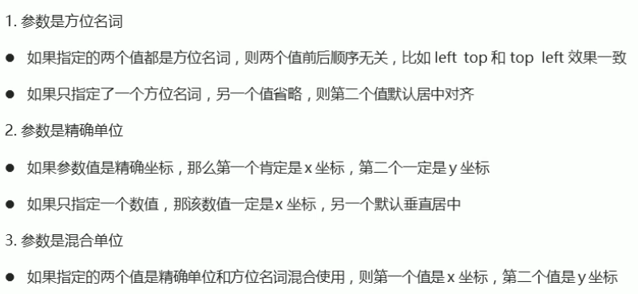

### 5.背景的复合写法

为了简化背景属性的代码，我们可以见这些属性合并简写在同一个属性background中，从而节约代码量。

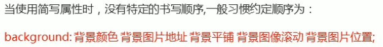

### 6.背景透明度

background：rgba(0,0,0,alpha);

- 最后一个参数是alpha，取值范围在0~1之间
- 习惯吧0.3的0省略掉，写为background:rgba(0,0,0.3);
- 注意：背景半透明是指盒子背景半透明，盒子里面的内容不受影响
- CSS新增属性，是IE9+版本的浏览器才支持的
- 但是实际开发中不太关注兼容性写法了

### 7背景总结

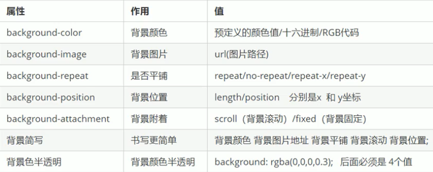

# 7.盒子模型

## 1.盒子模型组成部分

所谓==盒子模型==：就是把HTML页面中的布局元素看作是一个矩形的盒子，也就是一个盛放内容的容器。CSS盒子模型本质就是一个盒子，封装周围的HTML元素，它包括：边框，外边距，内边距和实际内容

## 2.盒子模型边框border

### 1.属性

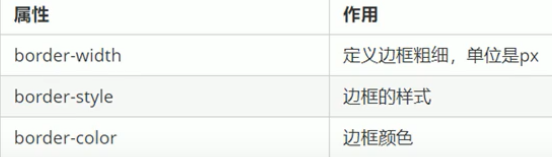

### 2.圆角边框

border-radius:length

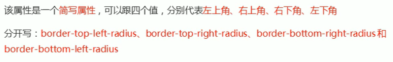

## 3.边框的复合写法

边框的简写为：

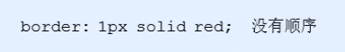

## 4.表格的细线边框

border-collapse：collapse  合并相邻的边框

## 5.内边距：padding

padding属性用于设定内边距，即边框与内容之间的距离

### 1.属性

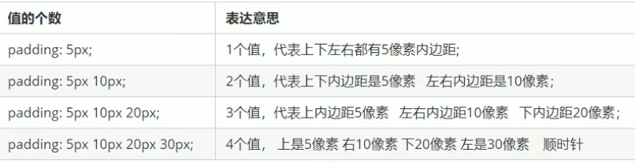

### 2.消除内外边距

*{

padding 0；/*消除内边距*/

margin 0；/*消除外边距*/

}

行内元素为了照顾兼容性，尽量只设置左右内外边距，不要设置上下内外边距。但是转换为块元素和行内块元素就可以了。

## 6.阴影

### 1.盒子阴影

CSS3中新增了盒子阴影，我们可以用box-shadow属性为盒子添加阴影。

语法：

**==box-shadow :  h-shadow v-shadow blur spread color inset;==**

<table>
    <tr>
        <th>值</th>
        <th>描述</th>
    </tr>
    <tr>
        <td>h-shadow</td>
        <td>必需。水平阴影的位置，允许负值。</td>
    </tr>
    <tr>
    	<td>v-shadow</td>
    	<td>必需。垂直阴影的位置，允许负值。</td>
	</tr>
	<tr>
    	<td>blur</td>
    	<td>可选。模糊距离</td>
	</tr>
	<tr>
    	<td>spread</td>
    	<td>可选。阴影的尺寸</td>
	</tr>
    <tr>
        <td>color</td>
        <td>可选。阴影的颜色。</td>
    </tr>
    <tr>
        <td>inset</td>
        <td>可选。将外部阴影（outset）改为内部阴影。</td>
    </tr>
</table>

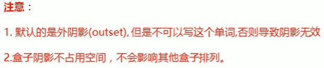

### 2.文字阴影

语法：

**==text-shadow : h-shadow v-shadow blur color;==**

<table>
    <tr>
        <th>值</th>
        <th>描述</th>
    </tr>
    <tr>
        <td>h-shadow</td>
        <td>必需。水平阴影的位置，允许负值。</td>
    </tr>
    <tr>
    	<td>v-shadow</td>
    	<td>必需。垂直阴影的位置，允许负值。</td>
	</tr>
	<tr>
    	<td>blur</td>
    	<td>可选。模糊距离</td>
	</tr> <tr>
        <td>color</td>
        <td>可选。阴影的颜色。</td>
    </tr>
</table>
# 8.浮动

## 1.为什么需要浮动？

**有很多种的布局效果，标准流没有办法完成，此时就可以利用浮动完成布局。因为浮动可以改变元素标签默认的排列方式。**

**浮动最典型的应用：可以让多个块级元素一行内排列显示。**

**网页布局第一准则：==多个块级元素纵向排列找标准流，多个块级元素横向排列找浮动。==**

## 2，什么是浮动？

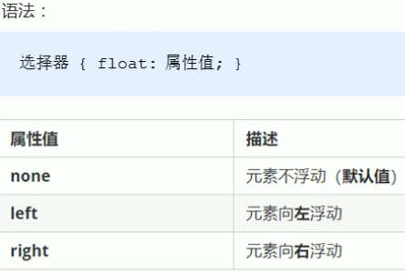

# X.精灵图

## 1.为什么需要精灵技术？

## 2.精灵图的使用

## 精灵图的案例