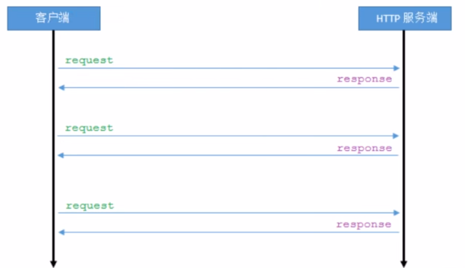
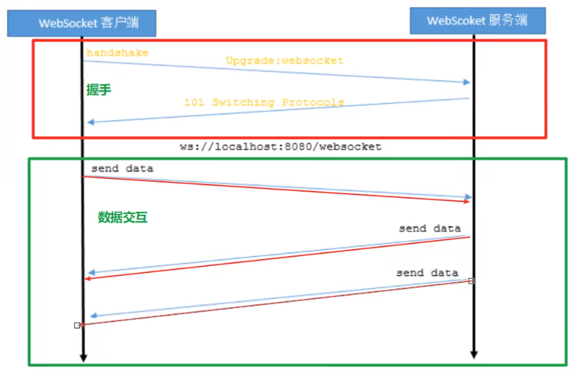

# Websocket

## Websocket介绍

Websocket是一种网络通信协议，为HTML5开始提供的一种在单个TCP连接上进行全双工通讯的协议。

HTTP协议是一种无状态、无连接的、单向的应用层协议。它采用了请求/响应模型。通讯请求只能有客户端发起，服务端对请求作出应答处理。故HTTP有弊端：**HTTP协议无法实现服务器主动向客户端发起消息。**这就注定了如果服务器有连续的状态变化，客户端要获知就非常麻烦。大多数Web应用程序将通过覅拿饭的异步Ajax请求进行长轮询，效率低下且浪费资源。

**HTTP协议：**



**Websocket协议：**



## Websocket协议

协议有两个部分：握手&数据传输

握手基于`HTTP`协议

来自客户端的握手形式如下：

```http
GET ws://localhost/chat HTTP/1.1
Host: localhost
Upgrade: Websocket
Connection: Upgrade
Sec-Websocket-Key: dGhlIHNhbXBsZSBub25jZQ==
Sec-Websocket-Extensions: permessage=deflate
Sec-Websocket-Version: 13
```

来自服务器的握手形式如下：

```http
HTTP/1.1 101 Switching Protocols
Upgrade: websocket
Connection: Upgrade
Sec-Websocket-Accept: s3pPLMBiTxaQ9kYGZZhZRbk+xOo=
Sec-Websocket-Extensions: permessage-deflate
```

字段说明：

| 头名称                    | 说明                                                         |
| ------------------------- | ------------------------------------------------------------ |
| Connection: Upgrade       | 表示该`HTTP`请求是一个协议升级请求                           |
| Upgrade: Websocket        | 协议升级为`Websocket`协议                                    |
| Sec-Websocket-Version: 13 | 客户端支持`Websocket`的版本                                  |
| Sec-Websocket-Key:        | 客户端采用base64编码的24位随机字符序列，服务器接受客户端HTTP协议升级的证明。要求服务端响应一个对应加密的`Sec-Websocket-Accept`头信息作为应答 |
| Sec-Websocket-Extensions  | 协议扩展类型                                                 |

##  客户端(浏览器)实现

### Websocket对象

实现Websocket的Web浏览器将通过Websocket对象公开所有必须的客户端功能(主要指支持HTML5的浏览器)

以下API用于创建Websocket对象：

```javascript
var ws = new Websocket(url);
```

> 参数URL格式说明: ws://ip地址:端口号/资源名称

### Websocket事件

Websocket对象的相关事件

| 事件    | 事件处理程序            | 描述                       |
| ------- | ----------------------- | -------------------------- |
| open    | Websocket对象.onopen    | 连接建立时触发             |
| message | Websocket对象.onmessage | 客户端接收服务端数据时触发 |
| error   | Websocket对象.onerror   | 通信发生错误时触发         |
| close   | Websocket对象.onclose   | 连接关闭时触发             |

### Websocket方法

| 方法 | 描述             |
| ---- | ---------------- |
| send | 使用连接发送数据 |

## 服务端实现

Tomcat的7.0.5版本开始支持Websocket，并且实现了Java Websocket规范(JSR356)。

Java Websocket应用由一系列的WebsocketEndpoint组成。Endpoint是一个java对象，代表Websocket链接的一段，对于服务端可以视为处理具体Websocket消息的接口，类似servlet与http请求一样。

定义Endpoint：

+ 编程式：即继承类javax.websocket.Endpoint并实现其方法
+ 注解式：即定义一个POJO，并添加@ServerEndpoint相关注解。

Endpoint实例在Websocket握手时创建，并在客户端与服务端链接过程中有效，最后在链接关闭时结束。在Endpoint接口中明确定义了与其生命周期相关的方法，确保规范实现者调用生命周期的各个阶段实例的相关方法。生命周期如下：

| 方法    | 含义描述                                                     | 注解     |
| ------- | ------------------------------------------------------------ | -------- |
| onClose | 当会话关闭时调用                                             | @OnClose |
| onOpen  | 当开启一个新的会话时调用，该方法是客户端与服务端握手成功后调用的方法 | @OnOpen  |
| onError | 当连接过程中异常时调用                                       | @OnError |

**服务端接收客户端发送的数据**

通过Session添加MessageHandler消息处理器来接收消息，当采用注解方式定义Endpoint时，可以使用@OnMessage注解指定接收消息的方法。

**服务端推送数据给客户端**

发送消息由RemoteEndpoint完成，其实例由Session维护，根据使用情况，可以通过Session.gerBasicRemote获取同步消息发送的实例，然后调用其sendXxx()方法就可以发送消息，可以用过Session.getAsyncRemote获取异步消息发送实例
